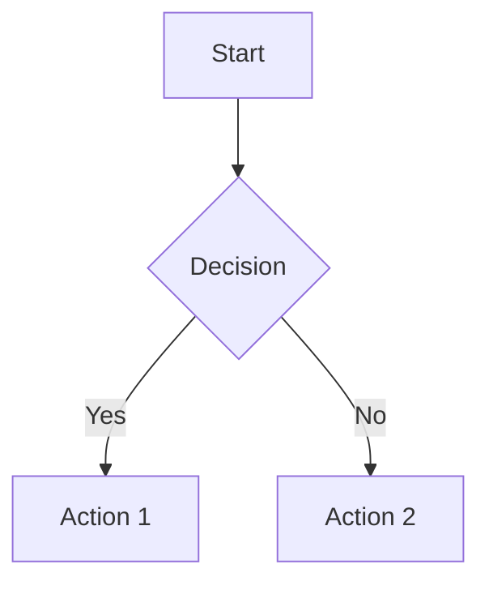

# MinimalMermaid Documentation

## Overview

MinimalMermaid là một editor Mermaid diagrams nhẹ, chạy trên browser với tính năng AI generation và real-time collaboration. Ứng dụng được xây dựng với TypeScript, Monaco Editor và tích hợp Google Generative AI.

## Features

### Core Features
- **Real-time Mermaid Preview**: Preview diagrams ngay lập tức khi gõ code
- **Monaco Editor Integration**: Syntax highlighting và auto-completion cho Mermaid
- **AI-Powered Generation**: Tạo diagrams từ natural language prompts
- **Real-time Collaboration**: Collaborative editing với Liveblocks
- **Export Capabilities**: Xuất diagrams dưới dạng SVG/PNG
- **URL Sharing**: Chia sẻ diagrams qua compressed URL hash

### Technical Features
- **TypeScript**: Type-safe development
- **Vite**: Fast build tool và HMR
- **Performance Optimized**: Debouncing, lazy loading, efficient rendering
- **Responsive Design**: Hoạt động tốt trên desktop và mobile
- **Local Storage**: Lưu trữ settings và API keys

## Quick Start

### Development Setup

```bash
# Clone repository
git clone <repository-url>
cd minimalmermaid

# Install dependencies
bun install

# Start development server
bun run dev
```

### Environment Variables

Create `.env` file:
```env
VITE_GOOGLE_AI_API_KEY=your_gemini_api_key
VITE_LIVEBLOCKS_PUBLIC_API_KEY=your_liveblocks_key
```

### Production Build

```bash
bun run build
bun run preview
```

## Documentation Structure

- [Architecture](./architecture.md) - System architecture và design patterns
- [API Reference](./api-reference.md) - Detailed API documentation
- [Components](./components.md) - Component documentation
- [Configuration](./configuration.md) - Configuration options
- [Deployment](./deployment.md) - Deployment guide
- [Development](./development.md) - Development workflow
- [Troubleshooting](./troubleshooting.md) - Common issues và solutions

## Usage Examples

### Basic Mermaid Diagram


### AI Generation
1. Nhập prompt: "Create a flowchart for user login process"
2. AI sẽ generate Mermaid code tương ứng
3. Preview tự động cập nhật

### Collaboration
1. Thêm `?room=room-name&name=your-name` vào URL
2. Chia sẻ URL với team members
3. Real-time collaborative editing

## Contributing

Xem [Development Guide](./development.md) để biết chi tiết về development workflow và coding standards.

## License

MIT License - xem LICENSE file để biết chi tiết. 