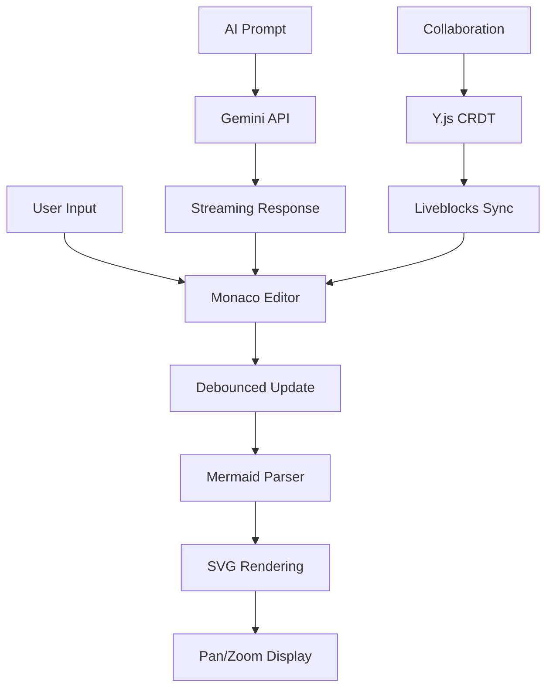

# MinimalMermaid Documentation

## Overview

MinimalMermaid is a modern, browser-based Mermaid diagram editor with AI-powered generation and real-time collaboration capabilities. Built with TypeScript, Vite, and Monaco Editor.

## Quick Links

- **[API Documentation](./api.md)** - Complete API reference for all classes and methods
- **[Development Guide](./development-guide.md)** - Comprehensive development workflow and patterns
- **[Project Structure](#project-structure)** - File organization and architecture overview

## Features

### 🤖 AI-Powered Generation
- **Google Gemini 2.5 Pro Integration** with real-time grounding
- **URL Context Analysis** for extracting diagram information
- **Automatic Error Fixing** with retry mechanisms
- **Preset System** for common diagram patterns

### 👥 Real-time Collaboration
- **Liveblocks + Y.js CRDT** for conflict-free editing
- **Multi-user Awareness** with cursor tracking
- **Room-based Sessions** via URL parameters

### 📝 Advanced Editor
- **Monaco Editor** with custom Mermaid language support
- **Syntax Highlighting** and error detection
- **Dark Theme** optimized for diagram editing
- **Responsive Layout** with resizable panes

### 📤 Export & Sharing
- **SVG Export** with full diagram fidelity
- **PNG Export** with high-quality rendering
- **URL Sharing** with compressed diagram state
- **Pan & Zoom** for large diagrams

## Getting Started

### Prerequisites
- Node.js v18+
- Bun package manager
- Modern browser with ES2020 support

### Installation
```bash
git clone <repository>
cd minimalmermaid
bun install
bun run dev
```

### Environment Setup (Optional)
```bash
# .env
VITE_LIVEBLOCKS_PUBLIC_API_KEY=your_liveblocks_key
VITE_GOOGLE_AI_API_KEY=your_google_ai_key
```

## Project Structure

```
minimalmermaid/
├── src/
│   ├── main.ts                    # MermaidEditor class & app entry
│   ├── ai-handler.ts             # Google Gemini AI integration
│   ├── collaboration.ts          # Liveblocks/Y.js collaboration
│   ├── config.ts                 # Configuration constants
│   ├── configMermaidLanguage.ts  # Monaco Mermaid language
│   ├── types.ts                  # TypeScript interfaces
│   ├── utils.ts                  # Utility functions
│   └── style.css                 # Application styles
├── docs/
│   ├── README.md                 # This file
│   ├── api.md                    # API documentation
│   └── development-guide.md      # Development guide
├── package.json                  # Dependencies and scripts
├── tsconfig.json                 # TypeScript configuration
├── vite.config.ts               # Vite build configuration
└── CLAUDE.md                    # AI assistant instructions
```

## Architecture Overview

### Core Components
- **MermaidEditor**: Main application controller
- **AIHandler**: Google Gemini AI integration
- **CollaborationHandler**: Real-time collaboration
- **Monaco Editor**: Code editing with custom language
- **Mermaid.js**: Diagram rendering engine

### Key Patterns
- **Event-Driven Architecture**: Component communication via events
- **Lazy Loading**: Dynamic imports for performance
- **Debounced Updates**: Smooth real-time editing
- **State Compression**: URL-based diagram sharing
- **CRDT Collaboration**: Conflict-free multi-user editing

### Data Flow


## Usage Examples

### AI Generation
```javascript
// Enter prompts like:
"Create a flowchart for user authentication"
"Add error handling to the current diagram"
"Convert this to a sequence diagram"
```

### Collaboration
```
https://your-domain.com/?room=project-alpha&name=John
```

### URL Sharing
```
https://your-domain.com/#N4IgdghgtgLgBh...  // Compressed diagram
```

## Browser Compatibility

### Minimum Requirements
- **Chrome**: 90+
- **Firefox**: 88+
- **Safari**: 14+
- **Edge**: 90+

### Required Features
- ES2020 support
- WebSocket for collaboration
- Local Storage for settings
- Canvas API for PNG export
- ResizeObserver for layout

## Development Commands

```bash
bun run dev      # Start development server
bun run build    # Production build
bun run preview  # Preview production build
```

## Contributing

### Development Workflow
1. Create feature branch from `main`
2. Follow established patterns (see [Development Guide](./development-guide.md))
3. Test manually through web interface
4. Update documentation as needed
5. Submit pull request with description

### Code Standards
- TypeScript strict mode
- Comprehensive error handling
- Performance-conscious implementations  
- Accessibility compliance
- Clear documentation

## Documentation Structure

- **[API Documentation](./api.md)** - Complete class and method reference
- **[Development Guide](./development-guide.md)** - Patterns, workflows, and best practices
- **[Architecture](./architecture.md)** - System design and component relationships
- **[Configuration](./configuration.md)** - Settings and environment variables
- **[Deployment](./deployment.md)** - Production deployment guide
- **[Troubleshooting](./troubleshooting.md)** - Common issues and solutions

## License

[Add your license information here] 