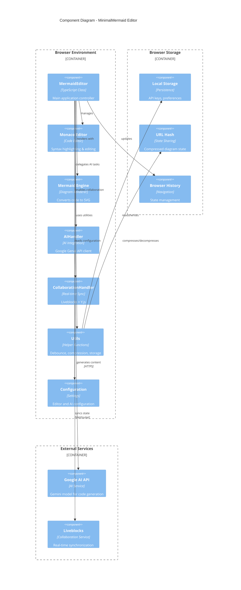
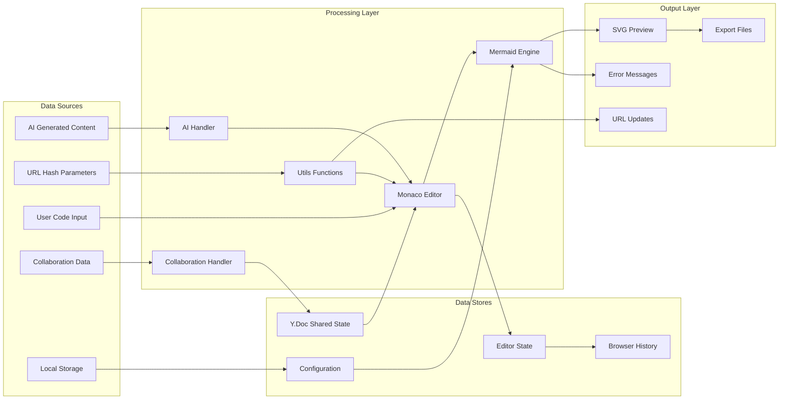
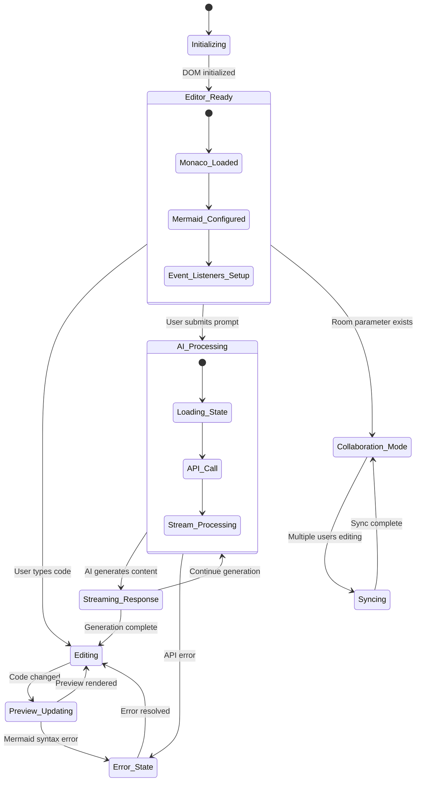

# Architecture Documentation

## System Overview

MinimalMermaid được thiết kế theo kiến trúc modular với separation of concerns rõ ràng. Ứng dụng sử dụng event-driven architecture kết hợp với observer pattern để đảm bảo real-time updates.

## High-Level Architecture



## Data Flow Architecture



## Core Components

### MermaidEditor (Main Controller)
- **Responsibility**: Orchestrates toàn bộ ứng dụng
- **Dependencies**: Monaco Editor, Mermaid, AIHandler, CollaborationHandler
- **Key Methods**:
  - `initializeDOM()`: Setup DOM elements
  - `setupEditor()`: Initialize Monaco editor
  - `renderDiagram()`: Render Mermaid diagrams
  - `updatePreview()`: Update preview pane

### AIHandler
- **Responsibility**: Quản lý AI integration
- **Dependencies**: Google Generative AI SDK
- **Key Features**:
  - Stream processing cho real-time generation
  - Context-aware prompts
  - Error handling và retry logic

### CollaborationHandler
- **Responsibility**: Real-time collaboration
- **Dependencies**: Liveblocks, Y.js, y-monaco
- **Key Features**:
  - CRDT-based conflict resolution
  - User awareness (cursors, selections)
  - Room-based collaboration

## State Management



## Design Patterns

### Observer Pattern
- Monaco Editor events trigger updates
- Debounced event handling cho performance
- Event-driven architecture

### Strategy Pattern
- Multiple render modes (SVG, PNG export)
- Different collaboration strategies
- Configurable AI models

### Singleton Pattern
- Configuration management
- Monaco instance management

### Factory Pattern
- Editor initialization
- Component creation

## Performance Optimizations

### Debouncing
```typescript
const debouncedUpdatePreview = debounce(this.updatePreview.bind(this), 250);
```

### Lazy Loading
```typescript
async function loadMonaco() {
  if (!monacoInstance) {
    const monaco = await import("monaco-editor");
    monacoInstance = monaco;
  }
  return monacoInstance;
}
```

### Compression
- URL state compression với LZ-String
- Efficient diagram sharing

### Memory Management
- Proper cleanup của event listeners
- ResizeObserver optimization

## Security Considerations

### API Key Management
- Local storage only
- Environment variables cho development
- No server-side storage

### Content Security
- Input sanitization
- XSS protection
- HTTPS-only external requests

## Scalability

### Horizontal Scaling
- Stateless design
- Client-side processing
- CDN-friendly assets

### Performance Scaling
- Efficient rendering
- Minimal DOM manipulation
- Optimized bundle size

## Future Architecture Considerations

### Microservices Migration
- AI service separation
- Collaboration service isolation
- Independent deployment

### PWA Features
- Service worker integration
- Offline support
- Background sync

### Plugin Architecture
- Extensible diagram types
- Custom AI providers
- Third-party integrations 