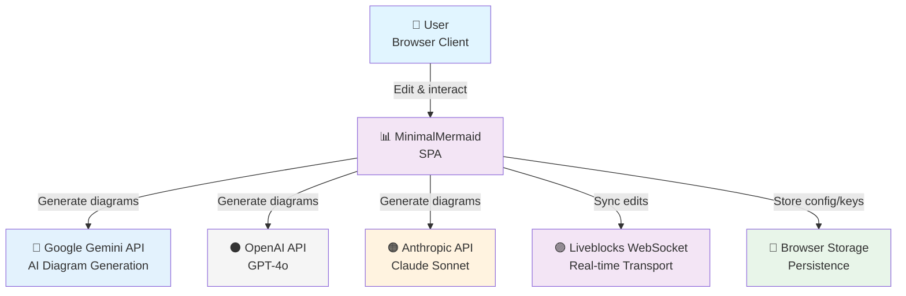
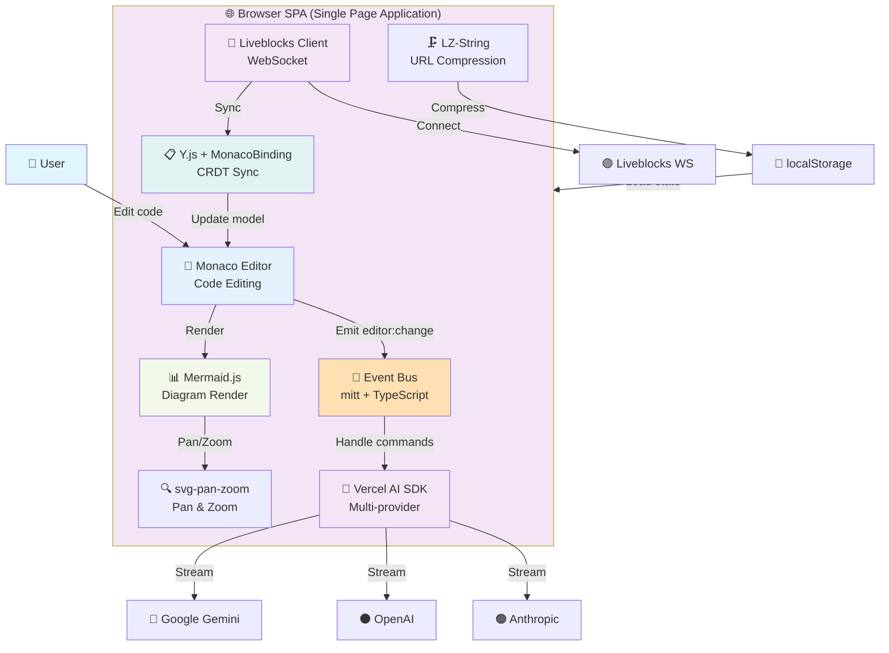
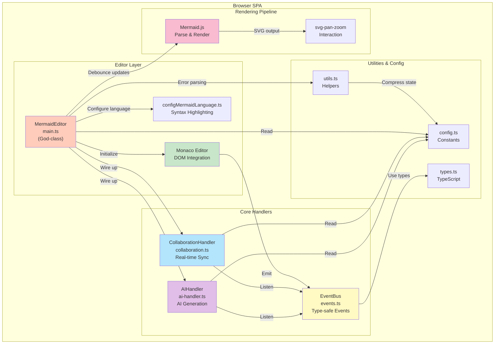

# MinimalMermaid Architecture (C4 Model)

**Document Version:** 1.0
**Last Updated:** 2026-03-11
**Audience:** Architects, new engineers, technology decision makers

---

## Overview

MinimalMermaid (mimaid) is a browser-based Mermaid diagram editor with built-in AI generation and real-time collaboration. The system is a single-page application (SPA) with no backend server. All diagram processing, rendering, and persistence happens client-side.

**Key Characteristics:**
- Fully client-side: Static deployment, zero backend infrastructure
- Event-driven: Loose coupling between components via type-safe event bus
- Multi-provider AI: Supports Google Gemini, OpenAI, and Anthropic via Vercel AI SDK
- Real-time collaboration: Optional Liveblocks + Y.js CRDT synchronization
- Performance-optimized: Lazy loading, debounced updates, compressed state

---

## C4 Context Diagram

External actors and systems that interact with MinimalMermaid:



**Actors:**
- **User**: Browser-based editor operator. Edits diagram code, generates via AI, shares via URL.
- **Google Gemini API**: Primary AI generation. Uses `gemini-2.5-pro` model with streaming responses.
- **OpenAI API**: Alternative AI provider. Uses `gpt-4o` model for diagram generation.
- **Anthropic API**: Third AI option. Uses `claude-sonnet-4-20250514` for generation.
- **Liveblocks**: WebSocket transport for real-time collaboration. Carries Y.js CRDT updates.
- **Browser Storage**: localStorage for API keys, settings, editor width, diagram code in URL hash.

---

## C4 Container Diagram

Single container: The browser SPA. Key libraries and their roles:



**Key Libraries & Versions:**

| Library | Version | Role |
|---------|---------|------|
| **monaco-editor** | 0.52.0 | Code editor with custom Mermaid syntax highlighting |
| **mermaid** | 11.9.0 | Diagram parsing and SVG rendering engine |
| **@ai-sdk/google** | 3.0.6 | Google Gemini provider integration |
| **@ai-sdk/openai** | 3.0.7 | OpenAI GPT provider integration |
| **@ai-sdk/anthropic** | 3.0.9 | Anthropic Claude provider integration |
| **ai** (Vercel) | 6.0.27 | Unified streaming API abstraction |
| **@liveblocks/client** | 2.11.0 | WebSocket client for real-time sync |
| **@liveblocks/yjs** | 2.11.0 | Y.js provider for Liveblocks |
| **yjs** | 13.6.20 | CRDT data structure for conflict-free edits |
| **y-monaco** | 0.1.6 | Monaco editor binding for Y.js |
| **lz-string** | 1.5.0 | URL-safe compression for diagram state |
| **svg-pan-zoom** | 3.6.2 | Pan and zoom for SVG diagrams |
| **mitt** | 3.0.1 | Lightweight event bus |

---

## C4 Component Diagram

Decomposition of the SPA into logical components. Code modules map to handler classes and utilities.



### Component Responsibilities

#### 1. MermaidEditor (src/main.ts)
**Role:** Application orchestrator and god-class.
**Responsibility:** Initialize all components, manage lifecycle, handle DOM events.

**Key Methods:**
- `initializeApplication()` - Entry point, chains all setup
- `initializeDOM()` - Cache DOM elements
- `loadMonaco()` - Lazy load Monaco editor
- `setupEventListeners()` - Wire up UI event handlers
- `handleDiagramRender()` - Debounced preview update (250ms delay)
- `displayMermaidError()` - Show inline error markers + overlay
- `setupPresets()` - Initialize AI preset buttons

**Dependencies:** Every other module (high coupling)
**Liabilities:** Cognitive complexity 318, 1000+ lines, lacks cohesion

#### 2. AIHandler (src/ai-handler.ts)
**Role:** AI diagram generation pipeline.
**Responsibility:** Multi-provider AI requests, stream processing, code extraction.

**Key Methods:**
- `handleSubmit()` - Validate input, build messages, stream from AI
- `buildMessages()` - Create context-aware prompt with current diagram
- `getSystemPrompt()` - Enforce Mermaid v11 syntax, no markdown in labels
- `handleStream()` - Consume streaming response, extract mermaid block
- `getModel()` - Factory pattern: select provider (google/openai/anthropic)

**Event Listeners:**
- `ui:input:submit` - Manual prompt submission
- `ui:preset:select` - Auto-fill from preset + context

**Dependencies:** AI_CONFIG, CREATION_PRESETS, MODIFICATION_PRESETS, EventBus
**Instability:** 0.92 (high fan-out to 12 dependencies)

#### 3. CollaborationHandler (src/collaboration.ts)
**Role:** Real-time multi-user editing.
**Responsibility:** Room management, Y.js CRDT setup, awareness protocol.

**Key Methods:**
- `setup()` - Check URL for `?room=name`, auto-connect if present
- `connectToRoom()` - Initialize Liveblocks client, set up Y.js, bind Monaco
- `disconnect()` - Clean up room and event listeners

**Event Listeners:**
- `collab:connect` - Connect to collaboration room
- `collab:disconnect` - Leave room

**State:**
- Y.js CRDT document `yDoc` with text shared as `monaco`
- Awareness protocol for user colors and names
- MonacoBinding syncs editor model to Y.js

**Lazy Loaded:** Only initialized if `?room` parameter present
**Dependencies:** Liveblocks, Y.js, MonacoBinding, EventBus

#### 4. Event Bus (src/events.ts)
**Role:** Decoupled component communication.
**Responsibility:** Type-safe event emission and listening with error boundaries.

**Event Categories:**

| Category | Examples | Emitted By |
|----------|----------|-----------|
| **editor:\*** | change, ready, error, resize | Monaco, MermaidEditor |
| **ai:\*** | start, progress, complete, error | AIHandler, streamText |
| **diagram:\*** | render, rendered, error | MermaidEditor, Mermaid.js |
| **ui:\*** | preset:select, settings:save, zoom, input:submit | UI buttons/forms |
| **collab:\*** | connect, disconnect, user:join, user:leave | URL params, Awareness |
| **app:\*** | ready, error, loading | Any component (error sink) |

**Helpers:**
- `safeEmit()` - Emit with try-catch, emit app:error on failure
- `safeListen()` - Listen with error wrapper, auto-emit app:error
- `once()` - One-shot listener with same error handling

**Implementation:** mitt event emitter wrapped with TypeScript generics

#### 5. Configuration (src/config.ts)
**Role:** Centralized constants.
**Responsibility:** Editor settings, AI defaults, preset prompts.

**Key Config Objects:**
- `EDITOR_CONFIG` - Zoom bounds (0.5x-20x), min width (20px), zoom step (0.1x)
- `AI_CONFIG` - Provider (google/openai/anthropic), API key, model, temperature
- `DEFAULT_MODELS` - Per-provider model defaults (Gemini 2.5 Pro, GPT-4o, Claude Sonnet)
- `MONACO_CONFIG` - Editor theme, glyph margin enabled, folding disabled
- `CREATION_PRESETS` - 8 diagram types (flowchart, sequence, class, gantt, ER, git, state, pie)
- `MODIFICATION_PRESETS` - 8 edit operations (simplify, add details, improve layout, etc.)

#### 6. Mermaid Language Config (src/configMermaidLanguage.ts)
**Role:** Monaco syntax highlighting and intellisense for Mermaid.
**Responsibility:** Monarch tokenizer, color theme, code completion.

**Features:**
- **Tokenizer:** 18 diagram types (flowchart, sequence, class, state, ER, gantt, git, pie, C4, quadrant, xy, sankey, architecture, mindmap, etc.)
- **Theme:** Custom "mermaid" theme with organic colors
- **Completion:** 15+ snippet templates (e.g., `flowchart` → full flowchart scaffold)
- **Bracket Matching:** Auto-pairing for (), [], {}

#### 7. Utilities (src/utils.ts)
**Role:** Pure helper functions.
**Responsibility:** URL state, error parsing, collaboration helpers.

**Key Functions:**

| Function | Purpose |
|----------|---------|
| `debounce(func, wait)` | Rate-limit function calls |
| `loadDiagramFromURL()` | Decompress code from hash (LZ-String) |
| `generateDiagramHash(code)` | Compress and store in URL |
| `parseMermaidError(error, code)` | Extract line/column from error |
| `inferErrorLine(message, code)` | Guess error location from patterns |
| `hasCommonSyntaxIssues(line)` | Check for bracket/arrow mismatches |
| `getRoomIdFromURL()` | Extract `?room=name` param |
| `getUserNameFromURL()` | Extract `?name=user` param or randomize |
| `getRandomColor()` | Generate hex color for collaboration |

---

## Data Flow

### Happy Path: User Edits and Renders Diagram

```
1. User types in Monaco Editor
   └→ editor:change event emitted
   └→ MermaidEditor debounces (250ms)
2. Debounce timer fires
   └→ Fetch code from editor.getValue()
   └→ Pass to Mermaid.render()
3. Mermaid parses and renders SVG
   └→ Success: Display preview, emit diagram:rendered
   └→ Error: Parse error, emit diagram:error
4. MermaidEditor catches error
   └→ Call parseMermaidError(error, code)
   └→ Extract line/column
   └→ Create monaco.editor.IMarkerData for inline display
   └→ editor.deltaDecorations() to show red squiggles
5. URL hash updated (async)
   └→ Generate compressed hash
   └→ history.replaceState() for sharing
```

### Happy Path: User Generates via AI

```
1. User submits prompt (manual input or preset)
   └→ ui:input:submit or ui:preset:select event
2. AIHandler.handleSubmit()
   └→ Read current editor code
   └→ Build messages with context
   └→ Get AI model from factory (google/openai/anthropic)
3. streamText() from Vercel AI
   └→ Emit ai:start event
   └→ Consume text stream
   └→ Look for ```mermaid code block
4. On complete code block found
   └→ editor.setValue() with new diagram
   └→ Trigger editor:change → render flow above
5. Error handling
   └→ ai:error event
   └→ Toast notification in UI
```

### Collaboration Flow: Real-time Sync

```
1. User A and B open same room (?room=shared)
2. CollaborationHandler.setup()
   └→ DetectURL room param
   └→ Emit collab:connect
3. connectToRoom()
   └→ Create Liveblocks client (publicApiKey auth)
   └→ Enter room (WebSocket connected)
   └→ Create Y.js doc + provider
   └→ Bind Monaco editor to Y.js text
4. Y.js syncs via Liveblocks
   └→ User A types → local Y.js update
   └→ LiveblocksYjsProvider pushes over WS
   └→ User B receives update → MonacoBinding updates editor
5. Awareness protocol
   └→ Both set local state (color, name)
   └→ awareness.on('change') → emit collab:user:join
   └→ UI shows active users
```

---

## Design Decisions

| Decision | Trade-off | Rationale | Risk |
|----------|-----------|-----------|------|
| **Client-only SPA** | No usage analytics, no rate limiting, API keys exposed. | Zero infrastructure cost, instant CDN deployment, simple architecture. | Keys can be stolen via XSS or browser dev tools. No backend fallback. |
| **God-class MermaidEditor** | Hard to test, cognitive complexity 318, tight coupling. | Started simple, grew organically. Easy for single developer. | Any change risks unrelated breakage. Hard onboarding for new team. |
| **Event-driven via mitt** | Harder to trace execution, fire-and-forget semantics. | Loose coupling between AIHandler, CollaborationHandler, UI. Easy to add handlers without modifying core. | Unexpected event order bugs, events may not fire if listener not registered in time. |
| **Lazy-load Monaco** | Editor loads with 250-500ms delay on first run. | Reduce initial bundle by ~2MB. Fast time-to-interactive for view-only mode. | User sees blank editor briefly. Errors during load crash app. |
| **Multi-provider AI** | Must maintain prompt compatibility across Google, OpenAI, Anthropic. | Users choose preferred provider, not locked in. Resilience. | Subtle differences in model behavior, higher test burden. |
| **Liveblocks + Y.js** | Requires WebSocket, adds ~100KB JS. Offline mode not supported. | Industry-standard CRDT for OT. Battle-tested in production. | Y.js learning curve, Liveblocks pricing, no offline-first. |
| **URL hash for sharing** | No persistent server storage. Link breaks if code > URL length. | No backend database, instant sharing, browser portable. | URLs can be very long, not shareable in all contexts. |
| **localStorage for API keys** | Keys visible in DevTools. Vulnerable to XSS. | No backend required, instant persistence across sessions. | Security risk if domain compromised. |

---

## Failure Modes & Resilience

| Failure | Detection | Response | Recovery |
|---------|-----------|----------|----------|
| **AI API rate limit** | `streamText()` throws error | `ai:error` event, show toast | User retries manually |
| **AI API outage** | Connection timeout | `ai:error` event, show toast | Manual edit or switch provider |
| **Mermaid parse error** | `mermaid.render()` throws | `parseMermaidError()` extracts line, show inline marker + overlay | User fixes syntax |
| **Collaboration disconnect** | WebSocket close | Room left, `collab:disconnect` emitted | No auto-reconnect; user must refresh |
| **localStorage unavailable** | `localStorage.getItem()` throws | Fallback to empty string / defaults | Settings don't persist; app still works |
| **Monaco lazy load fails** | Dynamic import error | App logs error, editor not initialized | Manual refresh, CDN issue |
| **XSS attack** | Third-party JS injection | No CSP headers, keys exposed | Attacker can steal keys and diagram code |
| **Y.js sync conflict** | Concurrent edits | CRDT resolves via Lamport clock | Both users see merged result (safe) |

**Mitigation:**
- Graceful degradation: AI features optional, editor works without it
- Error boundaries: EventHelpers catch and log all errors
- No crash: App continues even if AI/collab fail

---

## Performance Characteristics

### Bundle Size
- **Uncompressed:** ~2.5MB (Monaco is ~65% of total)
- **Compressed (gzip):** ~600KB
- **Critical path:** HTML → CSS → Monaco dynamic import (~500ms on 4G)

### Rendering Performance
- **Diagram preview update:** Debounced 250ms (user can trigger manually via button)
- **Monaco editor:** ~60fps on modern hardware, handles 5000+ line diagrams
- **Mermaid rendering:** 50-200ms depending on diagram complexity
- **URL hash update:** Async, no blocking
- **Collaboration:** Real-time via WebSocket, no latency if network stable

### Memory Usage
- **Base app:** ~50MB (Monaco initialization)
- **Large diagram (1000 lines):** +~5-10MB
- **Collaboration with 5 users:** +~2-5MB (Y.js overhead)

### Network
- **Initial load:** 1 HTML + 1 CSS + runtime JS (on-demand)
- **AI request:** ~2KB prompt, ~1-5KB response (streamed)
- **Collaboration:** 1 WebSocket + periodic CRDT sync (binary, ~100 bytes/keystroke)

---

## Architectural Constraints & Decisions

### Technology Stack Immutable
- **TypeScript:** Strict mode, no any escape hatches (enforced)
- **Vite:** Fast builds, must stay on latest major version
- **Monaco Editor:** Non-negotiable for code editing experience
- **Mermaid.js:** Latest v11 syntax only (no v10 backward compat)
- **Vercel AI SDK:** Abstracts provider differences, update frequently
- **Y.js:** CRDT library, no alternatives considered

### Architectural Invariants
1. **No backend server:** All processing client-side. Deployment via static CDN (Cloudflare Pages).
2. **Event-driven:** All component communication via type-safe event bus.
3. **Lazy loading:** Heavy libraries (Monaco, collaboration) loaded on-demand.
4. **URL as state:** Diagram code shareable via compressed hash.
5. **AI multi-provider:** Never lock into single provider.

### Quality Attributes
- **Availability:** 99.9% uptime (depends on CDN). AI features degrade gracefully.
- **Latency:** Sub-100ms for editor updates (local). AI generation 10-30s (network-dependent).
- **Scalability:** No server-side bottlenecks. Client-side resource limits (DOM, memory).
- **Security:** HTTPS only, CSP headers recommended (not yet implemented).
- **Maintainability:** Event-driven decoupling aids testing. God-class MermaidEditor hurts maintainability.

---

## Security Posture

### Current Vulnerabilities
1. **API Keys in localStorage:** Exposed to XSS, visible in DevTools
2. **No Content Security Policy (CSP):** Third-party scripts can inject code
3. **No input validation:** User prompts not sanitized before sending to AI
4. **Client-side only:** No rate limiting, no audit logs, no usage tracking

### Mitigations (Recommended)
1. Add CSP headers: `script-src 'self' https://apis.google.com https://api.openai.com`
2. Rotate API keys frequently
3. Sanitize AI prompts: Block malicious patterns
4. Add telemetry backend: Log errors, track features used (optional)

### What's Safe
- Diagram code: Mermaid syntax only, not arbitrary JavaScript
- No server-side RCE: No backend to exploit
- No database: No user data to steal (except API keys)
- Collaboration data: End-to-end sync via Y.js, Liveblocks sees encrypted blobs only

---

## Operational Concerns

### Deployment
- **Platform:** Cloudflare Pages (automatic via git push)
- **Build:** `bun run build` (TypeScript → Vite → JavaScript)
- **Environment variables:** `VITE_LIVEBLOCKS_PUBLIC_API_KEY` (Vite exposes at build time)
- **Build time:** ~10 seconds
- **Deploy time:** ~2 minutes (DNS propagation)

### Monitoring
- **No logging:** App has no backend, no centralized logs
- **Error tracking:** Errors logged to browser console only
- **Suggestions:** Add Sentry for client-side error reporting

### Browser Compatibility
- **Target:** Modern browsers with ES2020 support
- **Monaco:** Requires WebGL for syntax highlighting
- **Mermaid:** Requires SVG + canvas support
- **Collaboration:** Requires WebSocket
- **Tested:** Chrome, Firefox, Safari, Edge (latest versions)

---

## Known Limitations

1. **No undo/redo for collaboration:** Y.js doesn't integrate with Monaco undo. Users see edits from others but can't undo them.
2. **No offline mode:** Requires internet for AI and collaboration. Diagrams cached in localStorage only.
3. **No mobile optimization:** UI not responsive. Desktop-only experience.
4. **No diagram export:** Can't save as PNG/PDF. Share via URL only.
5. **No version history:** No way to revert to previous diagram versions.
6. **Limited error messages:** Mermaid errors often cryptic. Error parser attempts to improve readability.

---

## Dependency Graph

**Direct Dependencies (src code):**

```
main.ts
  ├→ AIHandler
  ├→ CollaborationHandler
  ├→ monaco-editor (lazy)
  ├→ mermaid
  ├→ svg-pan-zoom
  ├→ config.ts
  ├→ events.ts
  └→ utils.ts

ai-handler.ts
  ├→ ai (Vercel)
  ├→ @ai-sdk/google
  ├→ @ai-sdk/openai
  ├→ @ai-sdk/anthropic
  ├→ config.ts
  ├→ types.ts
  └→ events.ts

collaboration.ts
  ├→ @liveblocks/client
  ├→ @liveblocks/yjs
  ├→ yjs
  ├→ y-monaco
  ├→ y-protocols
  ├→ utils.ts
  ├→ types.ts
  └→ events.ts

events.ts
  ├→ mitt
  └→ types.ts

utils.ts
  ├→ lz-string
  └→ types.ts

config.ts
  └→ types.ts

types.ts
  └→ (no dependencies)
```

**No circular dependencies.** Dependency arrows flow downward: config ← everything, events ← everything, types ← everything.

---

## References & Appendices

### URL Parameters
- `?room=roomname` - Enable collaboration mode in named room
- `?name=username` - Set display name for collaboration (default: `User {random}`)
- `?hideEditor` - View-only mode (hides editor pane)
- `#compressed-code` - Hash fragment contains diagram code (compressed via LZ-String)

### Environment Variables
- `VITE_LIVEBLOCKS_PUBLIC_API_KEY` - Public key for Liveblocks (optional, disables collaboration if missing)
- `VITE_GOOGLE_AI_API_KEY` - Fallback Google API key (optional, uses localStorage first)

### Event Bus Reference
**Event Categories:** `editor:*`, `ai:*`, `diagram:*`, `ui:*`, `collab:*`, `app:*`

**Emission Pattern:**
```typescript
import { EventHelpers } from "./events";

// Emit with error handling
EventHelpers.safeEmit("ai:start", { prompt: "..." });

// Listen with error handling
EventHelpers.safeListen("ai:complete", ({ code }) => {
  editor.setValue(code);
});

// Listen once
EventHelpers.once("app:ready", () => {
  console.log("App initialized");
});
```

---

**Document Author:** Architecture Team
**Created:** 2026-03-11
**Last Reviewed:** 2026-03-11
**Status:** APPROVED

Generated with C4 Model methodology. See https://c4model.com for standards.
