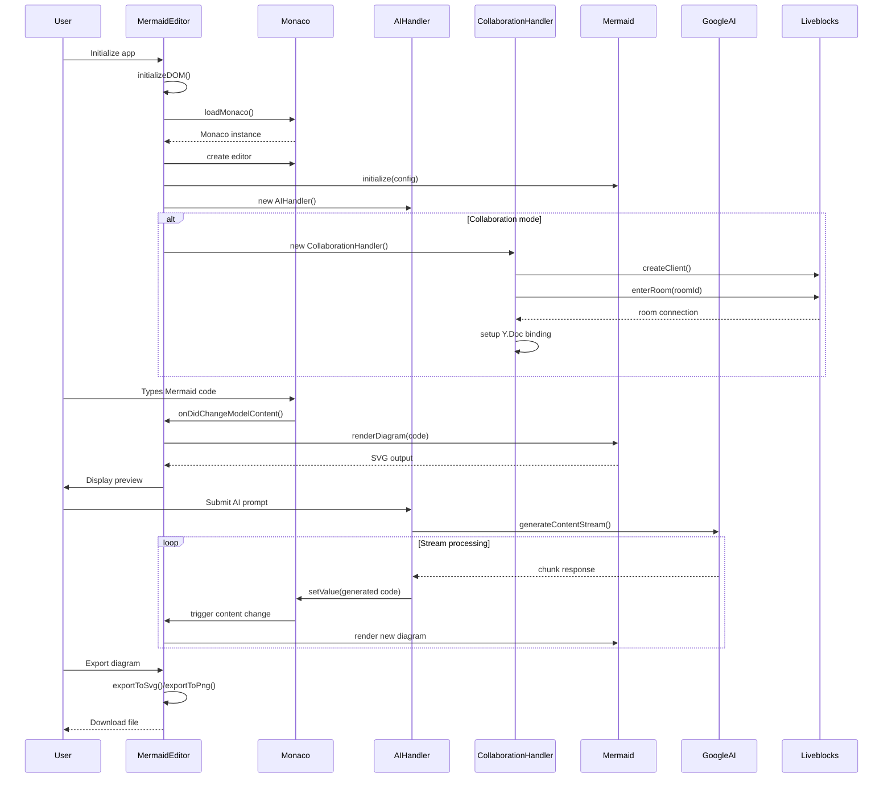

# Components Documentation

## Component Overview

MinimalMermaid được thiết kế với kiến trúc component-based, mỗi component có responsibility rõ ràng và interface chuẩn.

## Component Interaction Flow



## Core Components

### MermaidEditor (Main Controller)

**Location**: `src/main.ts`

**Responsibility**: 
- Orchestrates toàn bộ ứng dụng
- Manages component lifecycle
- Handles UI interactions và events

**Dependencies**:
- Monaco Editor
- Mermaid.js
- AIHandler
- CollaborationHandler (lazy loaded)

**Key Properties**:
```typescript
class MermaidEditor {
  private editor: monaco.editor.IStandaloneCodeEditor;
  private elements: EditorElements;
  private aiHandler: AIHandler;
  private collaborationHandler: CollaborationHandler;
}
```

**Initialization Flow**:
1. `initializeDOM()` - Setup DOM elements
2. `initializeMermaid()` - Configure Mermaid engine
3. `setupEditor()` - Create Monaco editor
4. `setupHandlers()` - Initialize AI và collaboration
5. `setupEventListeners()` - Bind events
6. `loadInitialState()` - Load from URL/storage

**Public Interface**:
- Export functionality (SVG/PNG)
- Zoom controls
- Settings management
- Error handling

### AIHandler

**Location**: `src/ai-handler.ts`

**Responsibility**:
- Google Generative AI integration
- Stream processing
- Context management cho prompts

**Dependencies**:
- Google Generative AI SDK
- Monaco Editor (for updates)

**Key Features**:
```typescript
class AIHandler {
  private client: GoogleGenAI;
  private previousPrompt: string;
  
  async handleSubmit(): Promise<void>
  private async handleStream(stream): Promise<void>
  private setLoadingState(loading: boolean): void
}
```

**AI Flow**:
1. Validate user input
2. Build context với previous prompts
3. Call Google AI API với streaming
4. Extract Mermaid code từ response
5. Update editor với generated code
6. Trigger preview update

**Error Handling**:
- API key validation
- Network error recovery
- Invalid response handling

### CollaborationHandler

**Location**: `src/collaboration.ts`

**Responsibility**:
- Real-time collaborative editing
- User awareness management
- Conflict resolution

**Dependencies**:
- Liveblocks client
- Y.js CRDT
- Monaco Y.js binding

**Setup Process**:
```typescript
class CollaborationHandler {
  setup(): void {
    // 1. Extract room ID từ URL
    const roomId = getRoomIdFromURL();
    
    // 2. Create Liveblocks client
    const client = createClient({
      publicApiKey: import.meta.env.VITE_LIVEBLOCKS_PUBLIC_API_KEY
    });
    
    // 3. Join room
    const { room } = client.enterRoom(roomId);
    
    // 4. Setup Y.js document
    const yDoc = new Y.Doc();
    const yText = yDoc.getText("monaco");
    
    // 5. Create provider
    const yProvider = new LiveblocksYjsProvider(room, yDoc);
    
    // 6. Setup awareness
    const awareness = yProvider.awareness;
    awareness.setLocalState({ color: userColor, name });
    
    // 7. Bind tới Monaco
    new MonacoBinding(yText, editor.getModel(), new Set([editor]), awareness);
  }
}
```

**Collaboration Features**:
- Real-time text synchronization
- User cursors và selections
- User name display
- Color-coded user identification

### Utils Module

**Location**: `src/utils.ts`

**Responsibility**:
- Helper functions
- State management utilities
- URL manipulation
- Storage operations

**Key Functions**:

#### `debounce<T>(func: T, wait: number): T`
Performance optimization cho frequent events.
```typescript
const debouncedUpdatePreview = debounce(this.updatePreview.bind(this), 250);
```

#### URL State Management
```typescript
function loadDiagramFromURL(): string | null {
  const hash = window.location.hash;
  const compressedCode = hash.slice(1);
  return LZString.decompressFromEncodedURIComponent(compressedCode);
}

function generateDiagramHash(code: string): void {
  const compressedCode = LZString.compressToEncodedURIComponent(code);
  window.history.replaceState(null, "", `#${compressedCode}`);
}
```

#### Collaboration Utilities
```typescript
function getRoomIdFromURL(): string | undefined
function getUserNameFromURL(): string
function getRandomColor(): string
```

### Configuration Module

**Location**: `src/config.ts`

**Responsibility**:
- Centralized configuration
- Environment variable management
- Default settings

**Configuration Objects**:
```typescript
export const EDITOR_CONFIG: EditorConfig = {
  minScale: 0.5,
  maxScale: 20,
  minWidth: 20,
  zoomFactor: 0.1,
};

export const AI_CONFIG: AIConfig = {
  apiKey: localStorage.getItem('googleAiApiKey') || import.meta.env.VITE_GOOGLE_AI_API_KEY,
  model: 'gemini-2.5-flash-preview-05-20',
  temperature: 1,
  maxTokens: 64000,
};

export const MERMAID_CONFIG = {
  startOnLoad: false,
};

export const MONACO_CONFIG = {
  language: 'mermaid',
  theme: 'mermaid',
  minimap: { enabled: false },
  scrollBeyondLastLine: false,
  automaticLayout: true,
};
```

### Language Configuration

**Location**: `src/configMermaidLanguage.ts`

**Responsibility**:
- Monaco editor language registration
- Mermaid syntax highlighting
- Auto-completion setup

**Features**:
- Comprehensive Mermaid keyword support
- Syntax highlighting rules
- Token classification
- Language configuration registration

## Component Communication Patterns

### Event-Driven Communication
```typescript
// Monaco editor events
editor.onDidChangeModelContent(() => {
  debouncedUpdatePreview();
  debouncedGenerateDiagramHash(editor.getValue());
});
```

### Dependency Injection
```typescript
// AIHandler constructor
constructor(
  editor: monaco.editor.IStandaloneCodeEditor,
  elements: { inputField, inputArea, generationStatus }
)
```

### Observer Pattern
```typescript
// ResizeObserver cho editor layout
const resizeObserver = new ResizeObserver(() => {
  requestAnimationFrame(() => {
    this.editor.layout();
  });
});
```

### Strategy Pattern
```typescript
// Different export strategies
exportToSvg(): void
exportToPng(): Promise<void>
```

## State Management

### Local State
```typescript
const state: EditorState = {
  scale: 1,
  translateX: 0,
  translateY: 0,
  isDragging: false,
  isResizing: false,
  startX: 0,
  startY: 0,
  zoomTranslateX: 0,
  zoomTranslateY: 0,
};
```

### Shared State (Collaboration)
```typescript
// Y.js shared document
const yDoc = new Y.Doc();
const yText = yDoc.getText("monaco");
```

### Persistent State
```typescript
// localStorage
localStorage.setItem("editorWidth", width);
localStorage.getItem("googleAiApiKey");

// URL hash
window.history.replaceState(null, "", `#${compressedCode}`);
```

## Error Boundaries

### AI Errors
```typescript
try {
  await this.client.models.generateContentStream(parts);
} catch (error) {
  console.error("Error processing prompt:", error);
  generationStatus.textContent = "❌ Failed to process prompt with AI";
}
```

### Mermaid Render Errors
```typescript
try {
  await mermaid.render('mermaid-preview', code);
} catch (error) {
  this.showError(error.message);
}
```

### Network Errors
```typescript
// Collaboration connection handling
yProvider.on('status', ({ status }) => {
  if (status === 'disconnected') {
    // Handle disconnection
  }
});
```

## Performance Optimizations

### Lazy Loading
```typescript
// Lazy load collaboration only when needed
if (window.location.search.includes('room')) {
  const { CollaborationHandler } = await import('./collaboration');
  this.collaborationHandler = new CollaborationHandler(this.editor);
}
```

### Debouncing
```typescript
const debouncedUpdatePreview = debounce(this.updatePreview.bind(this), 250);
const debouncedGenerateDiagramHash = debounce((code: string) => generateDiagramHash(code), 250);
```

### Memory Management
```typescript
// ResizeObserver cleanup
const resizeObserver = new ResizeObserver(() => {
  requestAnimationFrame(() => this.editor.layout());
});
resizeObserver.observe(this.elements.editorPane);

// Event listener cleanup
window.addEventListener('beforeunload', () => {
  resizeObserver.disconnect();
});
``` 