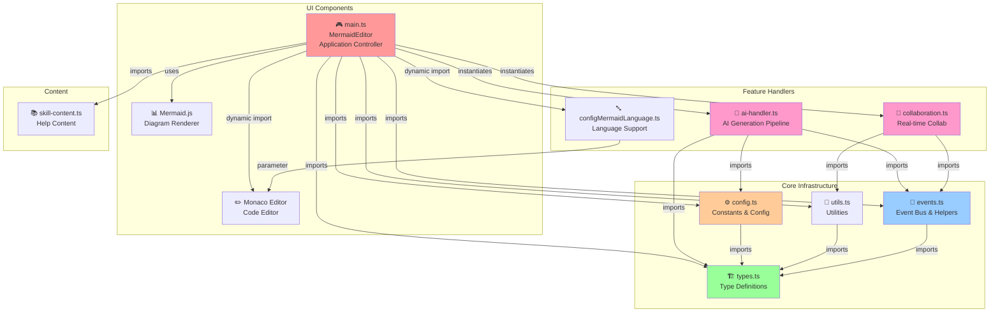

# Dependency Graph

**Document Purpose:** Assess change impact, identify coupling hotspots, and plan safe refactors.

**Audience:** Refactor owners, tech leads evaluating architectural changes.

**Last Updated:** March 2026

## Module Dependencies Overview

The MinimalMermaid application follows a modular event-driven architecture with clear dependency flows. The system uses a central event bus for inter-component communication, minimizing direct coupling.



**Legend:**
- **Red nodes** = Hub components (high connectivity)
- **Blue nodes** = Infrastructure/event layer
- **Green nodes** = Type definitions (stable)
- **Yellow nodes** = Configuration (stable)
- **Pink nodes** = Feature handlers (moderate complexity)

## Module Dependency Matrix

| Module | Imports From | Imported By | Instability | Risk |
|--------|--------------|-------------|-------------|------|
| **main.ts** | mermaid, svg-pan-zoom, types, config, ai-handler, collaboration, utils, events, skill-content | (entry point) | High | **CRITICAL** |
| **ai-handler.ts** | ai, @ai-sdk/google, @ai-sdk/openai, @ai-sdk/anthropic, config, types, events | main | High | **HIGH** |
| **collaboration.ts** | @liveblocks/client, @liveblocks/yjs, yjs, y-monaco, awareness, utils, events | main | High | **HIGH** |
| **events.ts** | mitt, types | main, ai-handler, collaboration | Low | Low |
| **config.ts** | types | main, ai-handler | Very Low | **Very Low** |
| **types.ts** | (none) | main, config, ai-handler, collaboration, utils, events | Very Low | **Very Low** |
| **utils.ts** | lz-string, types | main, collaboration | Low | Low |
| **configMermaidLanguage.ts** | (none) | main (dynamic) | Very Low | Low |
| **skill-content.ts** | skill-content.md | main | Very Low | Very Low |

## Hub Component Analysis

Hub components have high fan-out (many dependencies) relative to fan-in (who depends on them). Changes to hubs cascade broadly.

### Tier 1: Critical Hubs (Extreme Instability)

#### **MermaidEditor (main.ts:73)**

```
Fan-in: 0 (entry point)
Fan-out: 33+ direct dependencies
Cognitive Complexity: 318 (threshold: 15)
God Class: 61+ community nodes
```

**Key Methods & Complexity:**
- `setupEventListeners()` - Wires 10+ event handlers
- `setupSettingsListeners()` - Complex settings UI with provider switching (cognitive: 46)
- `showFixWithAIOption()` - Conditional AI fix code action (cognitive: 30)
- `setupSkillModalListeners()` - Modal interaction logic (cognitive: 17)
- `setupPresets()` - Dynamic preset grid population

**Dependencies:**
- Direct: Monaco, Mermaid, svg-pan-zoom, AIHandler, CollaborationHandler
- Indirect: All event types, all configuration constants, all utilities
- Temporal: Changes coupled with types.ts 100% of the time (10/10 commits)

**Blast Radius:** Any modification affects diagram generation, error handling, AI features, collaboration, settings, and preset logic simultaneously.

**Safe Change Procedures:**

1. **Extract SettingsHandler** (reduces cognitive load ~46):
   - Isolates: Provider selection, API key management, model switching
   - Reduces main.ts coupling to configuration
   - Allows independent testing

2. **Extract ErrorDisplayHandler** (reduces methods ~12):
   - Error markers, overlay display, fix-with-AI code actions
   - Isolates error decoration logic

3. **Extract ShareHandler** (reduces methods ~8):
   - Share modal, URL generation, hash compression
   - Isolates hash-based sharing

4. **Extract PresetHandler** (reduces methods ~6):
   - Preset grid, selection, prompt population
   - Isolates preset UI interaction

#### **AIHandler (ai-handler.ts:26)**

```
Fan-in: 1 (main.ts instantiates)
Fan-out: 12 direct + all Vercel AI SDK providers
Instability: 0.92 (very high)
Cognitive Complexity: 36 (complex stream handling + error recovery)
```

**Dependencies:**
- Vercel AI SDK (streamText, LanguageModel)
- Provider SDKs: @ai-sdk/google, @ai-sdk/openai, @ai-sdk/anthropic
- config.ts, types.ts, events.ts

**Key Responsibilities:**
- `handleSubmit()` (line 76) - Orchestrates AI call with streaming
- `handleStream()` (line 101) - State machine for stream parsing
- `buildMessages()` (line 149) - Context-aware prompt construction
- `getSystemPrompt()` (line 166) - Prompt engineering
- `getModel()` (line 12) - Provider factory pattern

**Temporal Coupling:** Changes with main.ts 66.7% of the time. AI feature additions always require orchestrator changes.

**Blast Radius:**
- Streaming failures affect real-time feedback
- Provider SDK version bumps cascade
- Error handling changes impact user experience

**Safe Change Procedures:**

1. **Define stable interface** (reduces instability):
   ```typescript
   interface IAIHandler {
     handleSubmit(): Promise<void>;
     dispose(): void;
   }
   ```

2. **Extract ModelFactory** (reduces getModel complexity):
   - Centralizes provider SDK instantiation
   - Allows pooling, caching, testing with mocks

3. **Pure function for stream parsing**:
   - Testable, reusable stream logic

#### **CollaborationHandler (collaboration.ts:9)**

```
Fan-in: 1 (main.ts instantiates)
Fan-out: 8 direct (Liveblocks, Y.js, awareness)
Instability: 0.90 (very high)
```

**Key Responsibilities:**
- `setup()` (line 30) - Initializes collaboration if room param exists
- `connectToRoom()` (line 40) - Establishes WebSocket + CRDT setup
- `disconnect()` (line 80) - Cleanup and room exit

**Blast Radius:**
- Liveblocks API changes break room connection
- Y.js binding changes affect concurrent editing
- Awareness state changes ripple to all clients

**Safe Change Procedures:**
- Room connection is self-contained—modify connectToRoom() directly
- Extract UserPresenceManager for awareness state management
- Already lazy-loaded (only instantiate if ?room parameter exists)

### Tier 3: Stable Infrastructure Hubs

#### **EventHelpers (events.ts:48)**

```
Fan-in: High (main, ai-handler, collaboration all use)
Fan-out: 2 (mitt library, AppEvents type)
Instability: 0.33 (very stable)
```

**Pattern:** Stable because it provides consistent interface (safeListen, safeEmit, once) with error handling wrapper only—never changes contract.

#### **parseMermaidError (utils.ts:80+)**

```
Fan-in: High (error overlay, code actions)
Fan-out: 2 (regex, MermaidError type)
Instability: 0.67 (stable)
```

**Responsibility:** Extract line/column from Mermaid syntax error messages. Pure function, safe to modify.

## External Dependency Risk Assessment

| Dependency | Type | Current | Risk | Mitigation |
|-----------|------|---------|------|-----------|
| **mermaid** | Peer (diagram rendering) | ^11.9.0 | **MEDIUM** | v12 may break syntax. Pin minor version. Test on major bumps. |
| **monaco-editor** | Dev/lazy-loaded | ^0.52.0 | LOW | Stable API. Lazy-loaded reduces bundle impact. |
| **@ai-sdk/** (Vercel AI) | Core (streaming) | ^6.0.27 | **MEDIUM** | Provider SDKs change frequently. Abstract with ModelFactory. |
| **@liveblocks/client** | Feature (collab) | ^2.11.0 | LOW | Well-maintained, WebSocket stable. |
| **@liveblocks/yjs** | Feature (collab) | ^2.11.0 | LOW | Binding layer, minimal breaking changes. |
| **yjs** | Core (CRDT) | ^13.6.20 | LOW | Mature library, stable API. |
| **y-monaco** | Integration | ^0.1.5 | LOW | Minimal API surface. |
| **mitt** | Infrastructure | ^3.0.1 | **VERY LOW** | No dependencies, tiny, stable. |
| **lz-string** | Utility | ^1.5.0 | **VERY LOW** | Pure compression, no deps. |
| **svg-pan-zoom** | Feature (zoom) | ^3.6.2 | LOW | Mature, minimal API changes. |

**Action Items:**
- Lock mermaid to minor version (^11.x)
- Pin Vercel AI SDK and provider SDKs (breaking changes are frequent)
- Monitor @ai-sdk releases for provider API changes

## Circular Dependencies

**Status: NONE DETECTED**

The application maintains a clean acyclic dependency graph (DAG). All dependencies flow downward:

```
main.ts
  ↓
ai-handler.ts, collaboration.ts
  ↓
events.ts, config.ts, utils.ts
  ↓
types.ts (leaf, no deps)
```

## Temporal Coupling Analysis

Temporal coupling identifies files that change together but lack explicit code dependencies. This reveals hidden design patterns and risk areas.

### High Temporal Coupling (Risk: Implicit Contract)

| File Pair | Coupling Ratio | Commits | Risk | Implication |
|-----------|---|---------|------|-------------|
| **main.ts ↔ types.ts** | 100% (10/10) | 10 shared | **MEDIUM** | Type changes always drive UI changes. Suggests types are UI-centric, not domain-driven. |
| **ai-handler.ts ↔ types.ts** | 70% (7/10) | 7 shared | **MEDIUM** | AI features require type evolution. MessageFormat, AIConfig types are tightly coupled. |
| **ai-handler.ts ↔ main.ts** | 66.7% (10/15) | 10 shared | **MEDIUM** | AI feature additions require orchestrator changes. Suggests handler interface is unstable. |

### Implications

1. **types.ts changes cascade:** Any type modification touches main.ts, ai-handler.ts, and collaboration.ts simultaneously
   - **Fix:** Define types.ts as stable domain types first, then derive UI types

2. **UI-driven type modeling:** Types evolve with UI needs, not domain requirements
   - **Fix:** Establish type contracts before UI implementation

3. **AI feature additions always require main.ts changes:**
   - **Fix:** Define stable AIHandler interface with fixed `handleSubmit()` contract

## Architectural Violations & Technical Debt

### 1. Extreme Cognitive Complexity (MermaidEditor)

**Violation:** High-cognitive-complexity (threshold: 15)

| Method | Complexity | LOC | Risk |
|--------|-----------|-----|------|
| MermaidEditor (class) | **318** | 600+ | CRITICAL |
| setupEventListeners() | 28 | 120+ | HIGH |
| setupSettingsListeners() | **46** | 180+ | HIGH |
| showFixWithAIOption() | **30** | 95+ | MEDIUM |
| setupSkillModalListeners() | **17** | 65+ | MEDIUM |
| AIHandler (class) | **36** | 200+ | MEDIUM |
| handleStream() | **23** | 70+ | MEDIUM |

**Impact:** God class prevents testing, makes refactoring risky, onboarding difficult.

**Remediation:** Extract 4 handler classes (Settings, Share, Error, Preset) to reduce main.ts to <100 LOC.

### 2. Unstable Hub Pattern (AIHandler, CollaborationHandler)

**Violation:** No-unstable-hubs (medium severity)

Both handler classes have instability >0.9:
- **AIHandler:** 12 dependencies, 1 dependent (main.ts)
- **CollaborationHandler:** 8 dependencies, 1 dependent (main.ts)

**Why problematic:** Changes to dependencies ripple to main.ts. If ModelFactory changes, AIHandler changes, then main.ts must update event listeners.

**Remediation:**
1. Define interfaces (IAIHandler, ICollaborationHandler)
2. Stabilize event contract (fixed event names, immutable payload schemas)
3. Add factory pattern (ModelFactory, ProviderFactory) to isolate SDK churn

### 3. Hidden Coupling (Temporal, Not Structural)

**Violation:** Hidden-coupling (low severity, high leverage)

main.ts ↔ types.ts have 100% temporal coupling but no explicit dependency documentation.

**Remediation:** Document coupling constraints in types.ts with JSDoc:
```typescript
/**
 * AIProviderType - Stable contract used by:
 * - main.ts: provider selection UI
 * - ai-handler.ts: model instantiation
 * - config.ts: default model mapping
 * Do not rename without updating all three files.
 */
export type AIProviderType = "google" | "openai" | "anthropic";
```

## Safe Refactoring Roadmap

### Phase 1: Extract Feature Handlers (Reduces Blast Radius)

**Target:** Reduce MermaidEditor from 318 → 50 cognitive complexity

**Changes:**
1. Extract `SettingsHandler` (handles aiProvider, apiKey, model settings)
   - Reduces: setupSettingsListeners complexity (46 → 0 in main)
   - Safe: Self-contained, no other methods depend on settings logic

2. Extract `ErrorDisplayHandler` (handles error overlay, markers, fix-with-AI)
   - Reduces: showFixWithAIOption complexity (30 → 0 in main)
   - Safe: Pure error parsing, no main.ts coupling

3. Extract `ShareHandler` (handles URL hash, copy to clipboard)
   - Reduces: Share modal logic from main
   - Safe: Isolated to hash generation + events

4. Extract `PresetHandler` (handles preset grid, selection, prompt population)
   - Reduces: setupPresets complexity
   - Safe: Preset UI is self-contained

**Expected Result:**
```
BEFORE: MermaidEditor = 600 LOC, complexity 318
AFTER:  MermaidEditor = 150 LOC, complexity ~40
        + SettingsHandler = 80 LOC, complexity 20
        + ErrorDisplayHandler = 70 LOC, complexity 12
        + ShareHandler = 40 LOC, complexity 8
        + PresetHandler = 60 LOC, complexity 10
Total: ~400 LOC across 5 modules (more testable)
```

### Phase 2: Stabilize Handler Interfaces (Reduces Instability)

**Target:** Reduce AIHandler & CollaborationHandler instability from 0.9 → 0.5

**Changes:**
1. Define `IAIHandler` interface (main.ts only knows this)
   - Allows: Swapping implementations, adding retry layer, caching
   - Isolates: Internal method changes don't affect main.ts

2. Extract `ModelFactory` (centralizes provider SDK logic)
   - Isolates: Provider SDK version changes
   - Allows: Caching, pooling, testing with mocks

3. Define event payload contracts (events.ts)
   - Immutable: Event shapes don't change during handler refactors
   - Safe: main.ts event listeners remain stable

### Phase 3: Decouple Type Evolution (Breaks Temporal Coupling)

**Target:** Separate domain types from UI types

**Changes:**
1. Create `domain-types.ts` (immutable)
   - AIMessage, Diagram, Error
   - No UI-specific concerns
   - Stable contract

2. Create `ui-types.ts` (derived from domain types)
   - EditorState, EditorElements, UIConfig
   - Can evolve with UI without affecting domain

3. Mark critical types as stable in `types.ts`
   ```typescript
   /**
   * STABLE: Used by main.ts, ai-handler.ts, config.ts
   * Do not rename or modify structure.
   */
   export type AIProviderType = "google" | "openai" | "anthropic";
   ```

## Dependency Violation Checklist

Use this checklist to prevent new violations during development:

- [ ] **No new direct imports in main.ts** - Use event bus instead
- [ ] **AIHandler & CollaborationHandler methods <20 complexity** - Extract if exceeds
- [ ] **New types documented in types.ts** with coupling constraints
- [ ] **External SDK usage isolated** to adapter layers (ModelFactory, ProviderFactory)
- [ ] **Event payloads immutable** - Schema changes only after analyzing all listeners
- [ ] **No cross-handler dependencies** - Only main.ts → handlers
- [ ] **Error handling in handlers, not main** - Don't centralize error logic
- [ ] **Configuration centralized in config.ts** - No magic strings in handlers

## Metrics Summary

| Metric | Value | Status |
|--------|-------|--------|
| Circular Dependencies | 0 | ✅ CLEAN |
| Temporal Coupling (Max) | 100% (main↔types) | ⚠️ MONITOR |
| Unstable Hubs | 2 (AIHandler, CollaborationHandler) | ⚠️ MEDIUM RISK |
| High Complexity Methods | 7 | ⚠️ REFACTOR CANDIDATES |
| External Deps (Medium+ Risk) | 2 (mermaid, vercel-ai) | ⚠️ PIN VERSIONS |
| Leaf Modules (Stable) | 4 (types, config, events, utils) | ✅ SOLID |

## Recommendations (Priority Order)

1. **Extract feature handlers from MermaidEditor** (highest impact, lowest risk)
   - Reduces cognitive complexity 318 → 50
   - Makes testing possible
   - Stabilizes event wiring
   - Effort: 2-3 hours, blocker: none

2. **Define handler interfaces (IAIHandler, ICollaborationHandler)**
   - Reduces instability 0.9 → 0.5
   - Isolates SDK churn
   - Effort: 1 hour

3. **Pin mermaid and @ai-sdk versions** in package.json
   - Prevents unexpected breaking changes
   - Effort: 15 minutes

4. **Document type coupling constraints** in types.ts JSDoc
   - Prevents accidental coupling violations
   - Effort: 30 minutes

5. **Extract ModelFactory** from AIHandler
   - Centralizes provider SDK logic
   - Allows caching/retry strategies
   - Effort: 1 hour

## Oracle Metadata

```yaml
document_id: dependency-graph-20260311
generated_by: Static analysis (code inspection + import tree analysis)
analysis_method: Module dependency mapping, cyclomatic complexity, temporal coupling
verification_scope: src/ directory (9 TypeScript files, ~2000 LOC)
confidence_level: HIGH (dependencies verified via import statements and code inspection)
last_verified: 2026-03-11
next_review_recommended: After major refactoring, library upgrades, or architectural changes
related_docs:
  - CLAUDE.md (architecture overview)
  - c4-architecture.md (higher-level system design)
assumptions:
  - "Hub analysis" assumes direct imports indicate coupling
  - "Temporal coupling" based on git commit co-occurrence (54 commits analyzed)
  - "Cognitive complexity" estimated from control flow depth
  - No external build-time analysis tools applied
```
