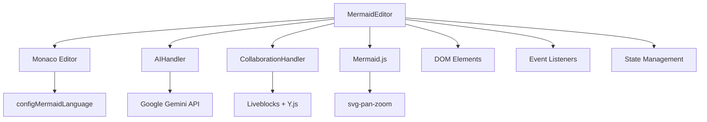

# MinimalMermaid Development Guide

## Project Overview

MinimalMermaid is a modern, browser-based Mermaid diagram editor featuring AI-powered diagram generation and real-time collaboration. Built with TypeScript, Vite, and Monaco Editor.

### Key Features
- **AI Integration**: Google Gemini 2.5 Pro with grounding and URL context
- **Real-time Collaboration**: Liveblocks + Y.js CRDT for multi-user editing
- **Advanced Editor**: Monaco with custom Mermaid language support
- **Export Options**: SVG and PNG export with high-quality rendering
- **Pan & Zoom**: Interactive diagram navigation
- **Preset System**: Dynamic presets for creation and modification
- **Error Recovery**: Automatic AI-powered error fixing

## Getting Started

### Prerequisites
- **Node.js**: v18+ recommended
- **Bun**: Package manager and runtime
- **Modern Browser**: ES2020 support required

### Installation
```bash
git clone <repository>
cd minimalmermaid
bun install
```

### Development Commands
```bash
bun run dev      # Start development server (http://localhost:5173)
bun run build    # Production build (TypeScript + Vite)
bun run preview  # Preview production build locally
```

### Environment Setup
Create `.env` file (optional):
```bash
VITE_LIVEBLOCKS_PUBLIC_API_KEY=your_liveblocks_key
VITE_GOOGLE_AI_API_KEY=your_google_ai_key
```

## Architecture Deep Dive

### Core Design Principles
- **Event-Driven Architecture**: Components communicate via events and observers
- **Lazy Loading**: Dynamic imports reduce initial bundle size
- **Debounced Operations**: Performance optimization for frequent updates
- **State Compression**: URL hash storage using LZ-String
- **CRDT Collaboration**: Conflict-free collaborative editing

### File Structure
```
src/
├── main.ts                    # MermaidEditor class & app entry
├── ai-handler.ts             # Google Gemini AI integration
├── collaboration.ts          # Liveblocks/Y.js collaboration
├── config.ts                 # Configuration constants
├── configMermaidLanguage.ts  # Monaco Mermaid language
├── types.ts                  # TypeScript interfaces
├── utils.ts                  # Utility functions
└── style.css                 # Application styles
```

### Component Interaction Flow


## Development Patterns

### Adding New Features

#### 1. Configuration First
Add constants to `config.ts`:
```typescript
export const NEW_FEATURE_CONFIG = {
  enabled: true,
  timeout: 5000,
  maxRetries: 3
};
```

#### 2. Type Definitions
Define interfaces in `types.ts`:
```typescript
export interface NewFeatureConfig {
  enabled: boolean;
  timeout: number;
  maxRetries: number;
}
```

#### 3. Implementation
Create handler class or extend existing ones:
```typescript
export class NewFeatureHandler {
  constructor(private editor: any) {}
  
  async handleFeature(): Promise<void> {
    // Implementation
  }
}
```

#### 4. Integration
Wire up in `MermaidEditor`:
```typescript
private async setupNewFeature(): Promise<void> {
  this.newFeatureHandler = new NewFeatureHandler(this.editor);
  await this.newFeatureHandler.initialize();
}
```

### Code Style Guidelines

#### TypeScript Best Practices
- **Strict Mode**: Full TypeScript strict mode enabled
- **Interface Segregation**: Small, focused interfaces
- **Error Handling**: Comprehensive try/catch with user feedback
- **Async/Await**: Prefer over Promise chains
- **Type Safety**: Avoid `any` except for dynamic imports

#### Event Handling Pattern
```typescript
private setupEventListeners(): void {
  const debouncedHandler = debounce(this.handleEvent.bind(this), 250);
  
  element.addEventListener('event', (e) => {
    e.preventDefault();
    requestAnimationFrame(() => {
      debouncedHandler(e);
    });
  });
}
```

#### Error Handling Pattern
```typescript
async handleOperation(): Promise<void> {
  try {
    this.setLoadingState(true);
    const result = await this.performOperation();
    this.handleSuccess(result);
  } catch (error) {
    console.error("Operation failed:", error);
    this.showUserFriendlyError(error);
  } finally {
    this.setLoadingState(false);
  }
}
```

### State Management Strategy

#### Application State
Simple object-based state in `MermaidEditor`:
```typescript
interface EditorState {
  isResizing: boolean;
  currentError: string | null;
  autoFixRetryCount: number;
}
```

#### Persistence Layers
- **localStorage**: API keys, user preferences
- **URL Hash**: Compressed diagram sharing
- **Y.js Document**: Collaborative editing state

#### State Update Pattern
```typescript
private updateState(updates: Partial<EditorState>): void {
  Object.assign(this.state, updates);
  this.notifyStateChange();
}
```

## AI Integration

### Google Gemini 2.5 Pro Features
- **Grounding**: Real-time web search for current information
- **URL Context**: Automatic analysis of provided URLs
- **Thinking Budget**: Enhanced reasoning for complex diagrams
- **Streaming**: Real-time response handling

### Prompt Engineering
```typescript
const systematicPrompt = `You are a Mermaid diagram expert with access to real-time information...

Core Capabilities:
- Create any type of Mermaid diagram
- Access current best practices via web search
- Analyze URLs for diagram-worthy information

Guidelines:
- Always respond with valid Mermaid syntax
- Use descriptive labels and clear connections
- Follow latest Mermaid best practices`;
```

### Response Processing
```typescript
async handleStream(stream): Promise<void> {
  let accumulatedCode = "";
  
  for await (const chunk of stream) {
    // Extract Mermaid code blocks
    const mermaidMatch = chunk.text.match(/```mermaid\n([\s\S]*?)```/);
    if (mermaidMatch) {
      accumulatedCode = mermaidMatch[1].trim();
      this.editor.setValue(accumulatedCode);
    }
  }
}
```

## Collaboration System

### Y.js CRDT Integration
```typescript
setup(): void {
  const yDoc = new Y.Doc();
  const yText = yDoc.getText("monaco");
  const yProvider = new LiveblocksYjsProvider(room, yDoc);
  
  new MonacoBinding(
    yText,
    this.editor.getModel(),
    new Set([this.editor]),
    yProvider.awareness
  );
}
```

### User Awareness
- **Color Assignment**: Random color generation for users
- **Name Display**: URL parameter or generated names
- **Cursor Tracking**: Real-time cursor and selection sharing

## Performance Optimization

### Bundle Size Optimization
- **Dynamic Imports**: Monaco Editor lazy loading
- **Code Splitting**: Collaboration features on-demand
- **Tree Shaking**: Vite automatic dead code elimination

### Runtime Performance
- **Debouncing**: 250ms for preview updates and URL generation
- **RequestAnimationFrame**: Smooth DOM updates
- **ResizeObserver**: Efficient layout adjustments
- **Memory Cleanup**: Event listener and observer cleanup

### Rendering Optimization
```typescript
private async renderMermaidDiagram(code: string): Promise<void> {
  // Create temporary rendering container
  const tempDiv = document.createElement('div');
  tempDiv.style.position = 'absolute';
  tempDiv.style.visibility = 'hidden';
  document.body.appendChild(tempDiv);
  
  const result = await mermaid.render("mermaid-diagram", code, tempDiv);
  
  requestAnimationFrame(() => {
    this.elements.mermaidPreview.innerHTML = result.svg;
    this.setupPanZoom();
    document.body.removeChild(tempDiv);
  });
}
```

## Testing Strategy

### Manual Testing Approach
Current testing relies on manual validation through the web interface:

1. **Diagram Rendering**: Test all Mermaid diagram types
2. **AI Integration**: Validate prompt processing and code generation
3. **Collaboration**: Test multi-user editing scenarios
4. **Export Functions**: Verify SVG/PNG export quality
5. **Error Handling**: Test syntax error recovery
6. **Browser Compatibility**: Cross-browser validation

### Potential Testing Framework
Consider adding:
- **Vitest**: Unit testing for utility functions
- **Playwright**: E2E testing for user workflows
- **Visual Regression**: Screenshot-based diagram testing

## Deployment Guide

### Build Process
```bash
bun run build
```

Output structure:
```
dist/
├── index.html          # Entry point
├── assets/
│   ├── index-[hash].js  # Main bundle
│   ├── index-[hash].css # Styles
│   └── monaco-[hash].js # Monaco chunks
```

### Production Considerations
- **HTTPS Required**: AI and collaboration APIs require secure contexts
- **API Key Management**: Client-side storage with environment fallbacks
- **CDN Optimization**: Static asset caching
- **Compression**: Gzip/Brotli compression recommended

### Environment Variables
Production `.env`:
```bash
VITE_LIVEBLOCKS_PUBLIC_API_KEY=pk_prod_...
VITE_GOOGLE_AI_API_KEY=AIza...
```

## Browser Compatibility

### Minimum Requirements
- **ES2020 Support**: Modern JavaScript features
- **WebSocket Support**: Required for collaboration
- **Local Storage**: Settings persistence
- **Canvas API**: PNG export functionality
- **ResizeObserver**: Layout optimization

### Tested Browsers
- **Chrome**: 90+
- **Firefox**: 88+
- **Safari**: 14+
- **Edge**: 90+

## Security Considerations

### API Key Management
- **Client-side Storage**: localStorage with environment fallbacks
- **No Server Persistence**: Keys never leave the client
- **Input Sanitization**: AI prompt validation
- **HTTPS Only**: Secure communication with external APIs

### Content Security Policy
Recommended CSP headers:
```
Content-Security-Policy: 
  default-src 'self'; 
  script-src 'self' 'unsafe-eval'; 
  style-src 'self' 'unsafe-inline'; 
  connect-src 'self' https://generativelanguage.googleapis.com https://liveblocks.io;
```

## Troubleshooting

### Common Issues

#### Monaco Editor Not Loading
```typescript
// Check dynamic import
const monaco = await import("monaco-editor");
if (!monaco) {
  console.error("Monaco failed to load");
}
```

#### AI Generation Failures
```typescript
// Verify API key configuration
const apiKey = localStorage.getItem("googleAiApiKey");
if (!apiKey) {
  this.showApiKeyWarning();
}
```

#### Collaboration Connection Issues
```typescript
// Check Liveblocks configuration
if (!import.meta.env.VITE_LIVEBLOCKS_PUBLIC_API_KEY) {
  console.warn("Liveblocks API key not configured");
}
```

### Debug Mode
Enable debug logging:
```typescript
const DEBUG = import.meta.env.DEV;
if (DEBUG) {
  console.log("Debug information:", data);
}
```

## Contributing Guidelines

### Development Workflow
1. **Feature Branch**: Create from `main`
2. **Implementation**: Follow established patterns
3. **Testing**: Manual validation required
4. **Documentation**: Update relevant docs
5. **Pull Request**: Include feature description

### Code Quality
- **TypeScript Strict**: No `any` types except dynamic imports
- **Error Handling**: Comprehensive try/catch blocks
- **Performance**: Consider bundle size and runtime impact
- **Accessibility**: WCAG compliance for UI elements

### Documentation Updates
- **API Changes**: Update `docs/api.md`
- **New Features**: Update this development guide
- **Configuration**: Update `CLAUDE.md` for AI assistance

## Advanced Patterns

### Custom Monaco Language
```typescript
// Register custom Mermaid language
monaco.languages.register({ id: 'mermaid' });

monaco.languages.setMonarchTokensProvider('mermaid', {
  tokenizer: {
    root: [
      [/graph|flowchart|sequenceDiagram/, 'keyword'],
      [/-->|---|->/, 'operator'],
      // Additional rules...
    ]
  }
});
```

### Dynamic Theme Management
```typescript
monaco.editor.defineTheme('mermaid-dark', {
  base: 'vs-dark',
  inherit: true,
  rules: [
    { token: 'keyword', foreground: '#569cd6' },
    { token: 'operator', foreground: '#d4d4d4' },
    // Theme definitions...
  ]
});
```

### URL State Management
```typescript
// Compress and store diagram state
const compressedCode = LZString.compressToEncodedURIComponent(code);
window.location.hash = compressedCode;

// Restore from URL
const decompressed = LZString.decompressFromEncodedURIComponent(hash);
```

This development guide provides a comprehensive foundation for working with MinimalMermaid. Follow these patterns and practices to maintain code quality and architectural consistency.