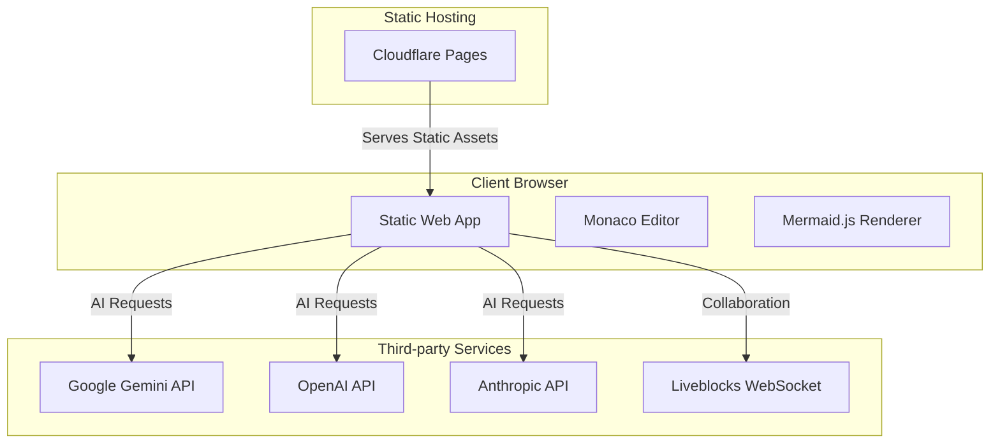

# Infrastructure

Build toolchain, deployment architecture, and environment setup for MinimalMermaid.

**Audience**: New engineers, DevOps, deployment engineers
**Scope**: Build process, deployment targets, environment configuration, infrastructure components
**Out of scope**: Feature code details, architectural decisions, code patterns

## Build Toolchain

MinimalMermaid uses a modern JavaScript build pipeline optimized for fast development and efficient browser deployment.

### Runtime & Package Manager

- **Bun 1.x** — package manager, script runner, and Node.js runtime replacement
- All development and build scripts execute via `bun run <script>` (package.json:6-10)
- Dependencies locked in `bun.lock` (text-based format for Cloudflare compatibility, per recent commit)

### Build System

| Tool | Version | Purpose |
|------|---------|---------|
| Vite | 5.4.10 | Fast bundler with dev server and HMR |
| TypeScript | 5.6.2 | Language and type-checking |
| vite-plugin-monaco-editor | 1.1.0 | Bundles Monaco Editor web workers |

### Build Commands

```bash
bun install              # Install dependencies
bun run dev              # Start dev server (http://localhost:5173, HMR enabled)
bun run build            # Compile: tsc && vite build
bun run preview          # Serve dist/ locally for testing production build
```

**Build Flow**: TypeScript compilation (`tsc --noEmit`) → Type errors caught early → Vite builds JavaScript/CSS bundles to `dist/` with content-hash filenames for long-term caching.

### TypeScript Configuration (tsconfig.json)

- **Target**: ES2020 (modern browser environments)
- **Module System**: ESNext with Bundler resolution
- **Strict Mode Enabled** (tsconfig.json:17-21):
  - `strict: true`
  - `noUnusedLocals: true` — catches dead code
  - `noUnusedParameters: true`
  - `noFallthroughCasesInSwitch: true`
  - `noUncheckedSideEffectImports: true`
- **Library Support**: DOM, DOM.Iterable, ES2020

Configuration treats all files as modules (`moduleDetection: "force"`), preventing accidental globals and improving build reliability.

## Dependencies

### Production Dependencies (11 packages)

**AI Integration** — Multi-provider support for diagram generation
- `ai` ^6.0.27 — Unified AI SDK for streaming responses
- `@ai-sdk/google` ^3.0.6 — Google Gemini provider (default)
- `@ai-sdk/openai` ^3.0.7 — OpenAI GPT models
- `@ai-sdk/anthropic` ^3.0.9 — Anthropic Claude models

**Collaboration** — Real-time multi-user editing
- `@liveblocks/client` ^2.11.0 — WebSocket transport and presence
- `@liveblocks/yjs` ^2.11.0 — Liveblocks Y.js binding
- `yjs` ^13.6.20 — CRDT (Conflict-free Replicated Data Type) library
- `y-monaco` ^0.1.6 — Monaco Editor Y.js binding for shared cursors/selections
- `y-protocols` ^1.0.6 — Y.js protocol utilities

**Core Application**
- `mermaid` ^11.9.0 — Diagram rendering engine (~800KB gzipped)
- `monaco-editor` ^0.52.0 — Code editor (~8-10 MB uncompressed, lazy-loaded)
- `svg-pan-zoom` ^3.6.2 — Pan and zoom controls for SVG diagrams
- `mitt` ^3.0.1 — Lightweight event bus for component communication
- `lz-string` ^1.5.0 — URL compression for diagram sharing (hash fragments)

### Development Dependencies (3 packages)

- `typescript ~5.6.2` — Type checker and transpiler
- `vite ^5.4.10` — Bundler and dev server
- `vite-plugin-monaco-editor ^1.1.0` — Worker bundling for Monaco

## Bundle Architecture

The build creates a static site in `dist/` with strategic code-splitting to minimize initial load time.

### Monaco Editor: Lazy Loaded

Monaco is the largest dependency. It is dynamically imported only on app initialization (src/main.ts:34-46), deferring ~8-10 MB of code until needed.

```typescript
// Dynamic import pattern reduces initial bundle
const monaco = await import("monaco-editor");
```

**Impact**: Initial page load excludes Monaco code; loads after user opens editor.

### Collaboration: Conditionally Loaded

CollaborationHandler (y-monaco, yjs, Liveblocks) is imported only when `?room` URL parameter is present. Users viewing diagrams solo do not load WebSocket/CRDT libraries.

### Mermaid: Startup Load

Mermaid is imported at startup (`src/main.ts:1`) and required for core functionality (diagram rendering). Cannot be deferred.

### Worker Configuration

vite-plugin-monaco-editor automatically bundles Monaco's web workers. No manual worker setup required; plugin handles registration.

### Vite Code-Splitting

Vite automatically splits dependencies into separate chunks:
- Initial chunk: app code + event system
- `mermaid.js` chunk
- `monaco-editor` chunk (loaded on demand)
- Vendor chunks for AI SDKs, Liveblocks, etc.

Asset filenames include content hash (e.g., `main.abc123.js`) enabling long-term browser caching.

## Entry Points & Configuration

- **HTML Entry**: `index.html` (module script at line 282 loads `/src/main.ts`)
- **App Bootstrap**: `src/main.ts` initializes MermaidEditor class and wires components
- **Vite Config**: No explicit `vite.config.ts` found; project uses Vite's default configuration

Vite auto-discovers entry point from `index.html` and project structure (TypeScript + src/ folder).

## Static Site Deployment

The build output (`dist/`) is a complete, self-contained static website. No backend server required.

### Output Structure

```
dist/
├── index.html              # Entry HTML (immutable reference, no-cache)
├── assets/
│   ├── main.abc123.js      # App bundle (content-hashed filename)
│   ├── mermaid.def456.js   # Mermaid library
│   ├── style.xyz789.css    # Compiled styles
│   └── ...                 # Other chunks
└── vite.svg                # Static asset
```

### Cache Strategy

- **index.html** — Response header `Cache-Control: no-cache` (always fetch fresh, but check ETag for revalidation)
- **assets/* (hashed)** — Response header `Cache-Control: max-age=31536000` (1 year, immutable)

This strategy ensures updates deploy cleanly without cache-busting issues.

### Deployment Targets

Any static file host supports MinimalMermaid:

- **Cloudflare Pages** — Primary target (auto-deploys on push, text-based bun.lock compatible)
- **Netlify** — Push to branch triggers deploy
- **Vercel** — Git integration available
- **GitHub Pages** — Static file hosting
- **AWS S3 + CloudFront** — Manual upload + CDN
- **Firebase Hosting** — CLI deployment
- **Docker** — Serve `dist/` with nginx

**Verification**: Recent commit `fix(build): switch to text-based bun.lock for Cloudflare compatibility` confirms Cloudflare Pages deployment.

## Environment Variables

Both variables are optional. AI API keys are configured by users via the in-app settings dialog, not environment variables.

```bash
VITE_LIVEBLOCKS_PUBLIC_API_KEY=pk_prod_...  # Optional: enables collaboration features
VITE_GOOGLE_AI_API_KEY=AIza...              # Optional: fallback Google AI API key
```

These are exposed to browser JavaScript as `import.meta.env.VITE_*` via Vite's environment system.

**Storage**: Not in version control. Set via hosting platform secrets (Cloudflare Pages: Settings > Environment variables).

## Client-Side Configuration

Users configure AI settings via in-app dialog (index.html:71-123). Settings stored in browser localStorage:

| Key | Value Type | Purpose |
|-----|-----------|---------|
| `aiProvider` | "google" \| "openai" \| "anthropic" | Selected AI provider |
| `aiApiKey` | string | User's API key for provider |
| `aiModel` | string | Selected model ID (e.g., "gemini-2.5-pro") |
| `editorWidth` | number | Persisted editor pane width in pixels |

**Notes**:
- All keys stored locally in browser only
- Not sent to MinimalMermaid backend (no backend exists)
- Survives page reload; cleared if user clears browser storage
- No server-side sync

## URL Parameters

The application accepts query parameters to customize behavior without persistence:

| Parameter | Type | Purpose | Example |
|-----------|------|---------|---------|
| `room` | string | Join Liveblocks collaboration room | `?room=project-x` |
| `name` | string | Set display name for collaboration | `?name=Alice` |
| `hideEditor` | flag | Enable view-only mode (preview only) | `?hideEditor` |
| `#<hash>` | string | Compressed diagram code in URL fragment | `#N4IgJglgzgPgngAwAVgQwOYEMB2CWAdiA` |

**Example**: `https://mimaid.example.com/?room=project-x&name=Alice&hideEditor#N4IgJglgzgPgngAwAVgQwOY...`

Diagram code is compressed using lz-string for shareable URLs (src/utils.ts `generateDiagramHash()`).

## Security Architecture

### API Key Handling

- All AI API keys (Google, OpenAI, Anthropic) stored **only** in browser localStorage
- Keys **never** sent to MinimalMermaid servers (no servers exist)
- Keys sent directly from browser to respective AI provider APIs
- HTTPS required for Liveblocks WebSocket connections (domain/certificate enforced)

### Content Security

- No inline scripts in HTML (module script only, line 282)
- No CSP headers configured in HTML (relies on hosting platform to set headers)
- User-provided text passed to AI prompts (prompt injection risk — users should review generated diagrams)

### Network Data Flow

```
Browser
  ├─→ Google Gemini API (if user selected + provided key)
  ├─→ OpenAI API (if user selected + provided key)
  ├─→ Anthropic API (if user selected + provided key)
  └─→ Liveblocks WebSocket (if ?room param + API key configured)
```

No traffic is proxied through or logged by MinimalMermaid infrastructure.

## Deployment Diagram



## Services & External Integrations

| Service | Type | Technology | Purpose |
|---------|------|-----------|---------|
| MinimalMermaid Web App | Static Site | HTML/JavaScript/CSS | User interface and diagram editing |
| Google Gemini API | External | REST/gRPC | AI diagram generation |
| OpenAI API | External | REST | AI diagram generation |
| Anthropic API | External | REST | AI diagram generation |
| Liveblocks | External | WebSocket | Real-time collaboration |
| Cloudflare Pages | CDN/Hosting | Static hosting | Deploy and serve dist/ |

All external services are called directly from the browser; no proxy or backend gateway exists.

## CI/CD Pipeline

### Pipeline: Claude Code

**Trigger**: Issue comments, PR review comments, or issues containing `@claude`

**Stages**:
1. Checkout — Fetches repository code
2. Run Claude Code — Executes anthropics/claude-code-action with OAuth token
3. Additional Permissions — Grants read access to CI results for PR comments

### Pipeline: Claude Code Review

**Trigger**: Pull requests (opened or synchronized)

**Stages**:
1. Checkout — Fetches repository code
2. Run Claude Code Review — Executes Claude with review prompt focusing on code quality, bugs, performance, security, and test coverage
3. PR Comment — Uses `gh pr comment` to leave review as PR comment

## Environment Configuration

| Variable | Required | Description | Example |
|----------|----------|-------------|---------|
| `VITE_LIVEBLOCKS_PUBLIC_API_KEY` | No | Liveblocks public API key for collaboration | `pk-production-xxxxx` |
| `VITE_GOOGLE_AI_API_KEY` | No | Fallback Google AI API key | `AIzaSy...` |
| `CLAUDE_CODE_OAUTH_TOKEN` | Yes* | OAuth token for GitHub Actions (CI/CD only) | `ghp_xxxxx` |

* Required for CI/CD pipelines only, not application runtime

**Note**: API keys for AI generation are stored client-side in localStorage, not as environment variables. Users configure their own keys via the settings UI (src/main.ts:423-425).

## Cloud Services

| Provider | Service | Used For | Configuration |
|----------|---------|----------|--------------|
| Cloudflare | Pages | Static hosting and deployment | Auto-deploys on push to repository |
| Google | Gemini API | AI diagram generation | User-provided API key via settings |
| OpenAI | GPT Models | AI diagram generation | User-provided API key via settings |
| Anthropic | Claude Models | AI diagram generation | User-provided API key via settings |
| Liveblocks | Liveblocks Yjs | Real-time collaboration | `VITE_LIVEBLOCKS_PUBLIC_API_KEY` |
| GitHub | Actions/Workflows | CI/CD automation | `.github/workflows/*.yml` |

## Build Configuration

**TypeScript Compilation**:
- Target: ES2020 (tsconfig.json:3)
- Module: ESNext with bundler resolution (tsconfig.json:5, 10)
- Strict mode enabled with unused locals/parameters checking (tsconfig.json:17-20)

**Vite Build**:
- Dev server: `vite` (package.json:7)
- Build: `tsc && vite build` (package.json:8)
- Preview: `vite preview` (package.json:9)
- Monaco Editor loaded via dynamic import to reduce bundle size (src/main.ts:34-46)

**No Backend Server**: Application is fully client-side with no server-side components.

## Testing & Validation

**Type Checking** — Catches errors at build time
```bash
bun run build    # tsc runs first; fails if type errors exist
```

**Manual Testing** — No automated test framework configured
- Start dev server: `bun run dev`
- Open http://localhost:5173 in browser
- Test features manually (diagram editing, AI generation, collaboration, export)

**Mermaid Syntax Validation** — Inline error feedback
- Syntax errors display in Monaco editor with line/column markers
- Error parsing via `parseMermaidError()` in src/utils.ts
- Visual indicators: inline red squiggles, error overlay, glyph margin icons

**Browser Compatibility Testing**
- No explicit browserslist config; defaults to ES2020 support
- Test on: Chrome, Firefox, Safari, Edge (latest versions)
- WebSocket required for collaboration features (all modern browsers)

## Observability & Monitoring

**Not Configured** — MinimalMermaid has no backend, so no server logs or APM.

Error visibility relies on:
- Browser console (`F12 → Console`)
- In-app error messages (Mermaid validation, AI generation failures)
- User reports (GitHub Issues)

**Future Improvements**:
- Add Sentry or similar client-side error tracking
- Log diagram sizes and generation latency to analytics
- Monitor API quota usage per AI provider

## Known Limitations & Unknowns

### 1. No Explicit vite.config.ts

**Issue**: Project relies on Vite defaults
- No custom build optimizations configured
- Plugin setup minimal (only vite-plugin-monaco-editor)
- Bundle splitting not explicitly configured

**Action Required**:
- Create `vite.config.ts` with explicit configuration if custom optimization needed
- Example: configure aggressive chunk splitting, minification settings, source maps for production

**Verification**:
```bash
bun run build
du -sh dist/          # Check total bundle size
ls -1 dist/assets/    # Inspect chunk filenames and sizes
```

### 2. Bundle Size Unmeasured

**Issue**: No automated bundle analysis
- Monaco Editor is ~8-10 MB uncompressed (lazy-loaded, so not critical)
- Mermaid.js is ~800 KB gzipped (startup blocker)
- Combined gzipped size unknown

**Action Required**:
- Add rollup-plugin-visualizer or webpack-bundle-analyzer
- Measure before/after for dependency updates
- Set bundle size budgets in CI

**Example Config** (vite.config.ts):
```typescript
import { visualizer } from 'rollup-plugin-visualizer';

export default {
  plugins: [visualizer({ open: true })],
};
```

### 3. Browser Support Matrix Implicit

**Issue**: No explicit browserslist; TypeScript target ES2020
- Assumes modern browsers with WebSocket and dynamic import support
- No polyfills for older browsers
- No explicit testing on IE11, older Safari, etc.

**Action Required**:
- Add browserslist in package.json if targeting older browsers
- Test on actual target browsers before release
- Document minimum browser versions (e.g., "Chrome 90+, Firefox 88+, Safari 14+")

### 4. Deployment Pipeline Unknown

**Issue**: Git history mentions Cloudflare Pages but no wrangler.toml found
- No explicit CI/CD deployment scripts visible
- GitHub Actions runs Claude Code integration only (not build/deploy)
- Actual deployment mechanism unclear

**Action Required**:
- Check Cloudflare Pages dashboard for active deployment branch and build settings
- Verify build command in Cloudflare Pages config matches `bun run build`
- Check for auto-deploy on push (should be enabled by default)

**Verification**:
```bash
# Check git remote
git remote -v
# Check GitHub Actions workflows
ls -la .github/workflows/
```

### 5. No Service Worker / Offline Support

**Issue**: App requires network connection; no offline mode
- No cached assets for offline use
- No background sync for collaboration

**Future Enhancement**:
```typescript
// src/service-worker.ts
if ('serviceWorker' in navigator) {
  navigator.serviceWorker.register('/sw.js');
}
```

## Development Workflows

### Local Development Setup

```bash
# Clone and install
git clone https://github.com/your/repo.git
cd mimaid
bun install

# Start dev server with HMR
bun run dev
# Open http://localhost:5173

# Edit src/main.ts, save → browser updates instantly (HMR)
```

### Building for Production

```bash
# Build and test production bundle
bun run build
bun run preview
# Open http://localhost:4173

# Test production features (collaboration, AI, etc.) before deploy
```

### Adding Dependencies

```bash
# Production dependency
bun add <package>

# Dev dependency
bun add -d <package>

# Bun auto-updates package.json and bun.lock
```

**Important**: Keep bun.lock in version control (text-based format for Cloudflare compatibility).

### Deploying to Cloudflare Pages

**Option 1: Auto-Deploy (Recommended)**
- Push code to configured branch (main)
- Cloudflare Pages automatically triggers build
- Build command: `bun run build`
- Build output: `dist/`

**Option 2: Manual Deploy**
```bash
# Install Wrangler CLI
bun add -d wrangler

# Authenticate
bun wrangler pages login

# Deploy
bun wrangler pages deploy dist/
```

## Performance Optimization Checklist

### Current Optimizations

- [x] Monaco Editor lazy-loaded (dynamic import on startup)
- [x] Collaboration lazy-loaded (only when ?room param)
- [x] Debounced preview updates (250ms, src/main.ts)
- [x] ResizeObserver for responsive layout (no polling)
- [x] Content-hashed assets for caching

### Potential Improvements

- [ ] Lazy load Mermaid library (currently required at startup)
- [ ] Implement worker threads for diagram rendering
- [ ] Add service worker for offline support
- [ ] Minify CSS (modern-normalize.css, style.css)
- [ ] Optimize font loading (Google Fonts preconnect present, but preload could help)
- [ ] Analyze and compress SVG assets (vite.svg)
- [ ] Configure explicit code-splitting in vite.config.ts
- [ ] Set up bundle size monitoring in CI

### Measuring Impact

```bash
# Analyze bundle composition
bun run build && ls -lh dist/assets/ | sort -k5 -rn

# Before/after size comparison
# Track: dist/ total size, js chunk count, largest chunks

# Lighthouse performance audit
# Open dist in browser, run Lighthouse (DevTools → Lighthouse)
```

## Troubleshooting

### Build Fails with Type Errors

```bash
bun run build
# Error: src/main.ts(123) Type 'X' is not assignable to type 'Y'
```

**Fix**: Run `tsc` separately to see all errors
```bash
npx tsc --noEmit
```

### Dev Server Slow / HMR Not Working

```bash
# Kill any existing Vite processes
lsof -i :5173 | grep -v PID | awk '{print $2}' | xargs kill -9

# Restart
bun run dev
```

### AI Generation Fails

1. Check browser console for API errors
2. Verify API key in settings dialog (correct format, not expired)
3. Verify network request in DevTools (Network tab)
4. Check AI provider API status dashboard (e.g., Google Cloud Console)

### Collaboration Not Working

1. Verify `?room=` parameter in URL
2. Verify VITE_LIVEBLOCKS_PUBLIC_API_KEY is set in environment
3. Check browser console for Liveblocks connection errors
4. Verify HTTPS (Liveblocks WebSocket requires secure context)

---

## References

- [Vite Documentation](https://vitejs.dev/)
- [TypeScript Handbook](https://www.typescriptlang.org/docs/)
- [Monaco Editor Documentation](https://microsoft.github.io/monaco-editor/)
- [Mermaid.js Documentation](https://mermaid.js.org/)
- [Cloudflare Pages](https://pages.cloudflare.com/)
- [Liveblocks Documentation](https://liveblocks.io/docs)

---

**Oracle Metadata**
- **Documentation Date**: 2026-03-11
- **Build Verification**: Vite 5.4.10, TypeScript 5.6.2, Bun with text-based bun.lock
- **Primary Audience**: Engineers onboarding, DevOps deploying, builders optimizing
- **Scope**: Build toolchain, deployment architecture, environment setup
- **Out of Scope**: Feature code patterns, architectural decisions, business logic
- **Last Updated**: 2026-03-11 (documented all tooling, deployment targets, environment configuration, known limitations)
