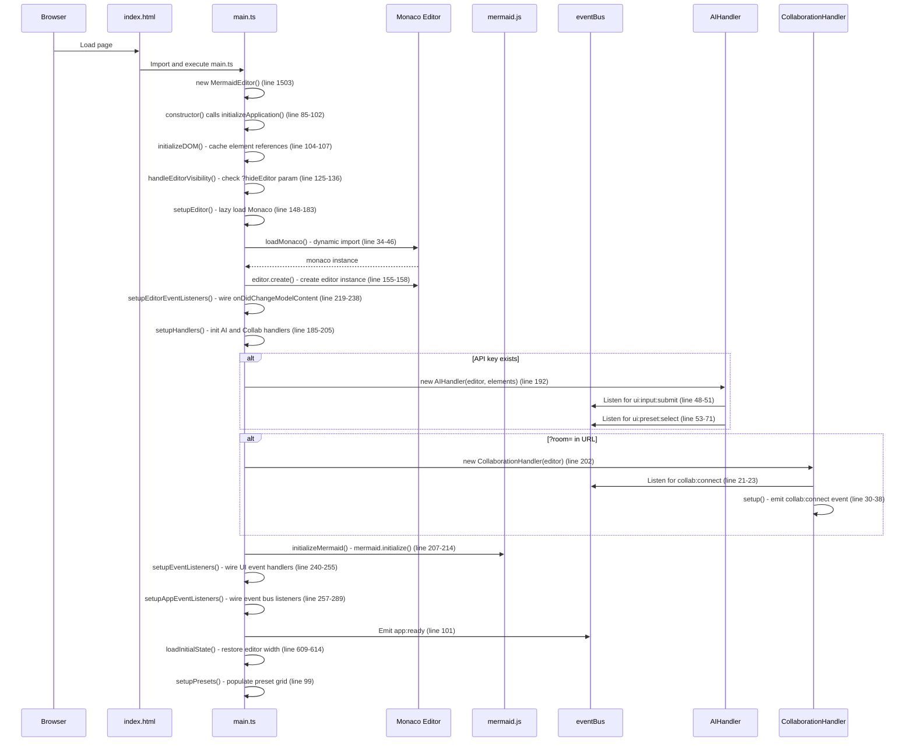
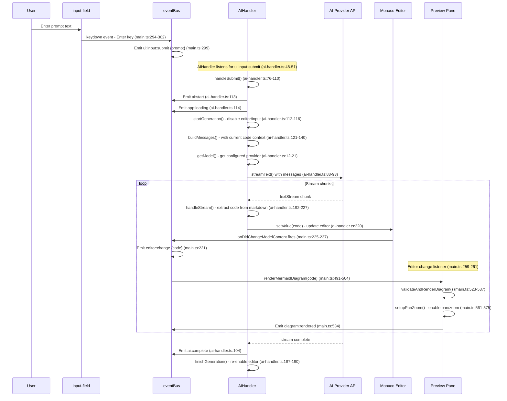
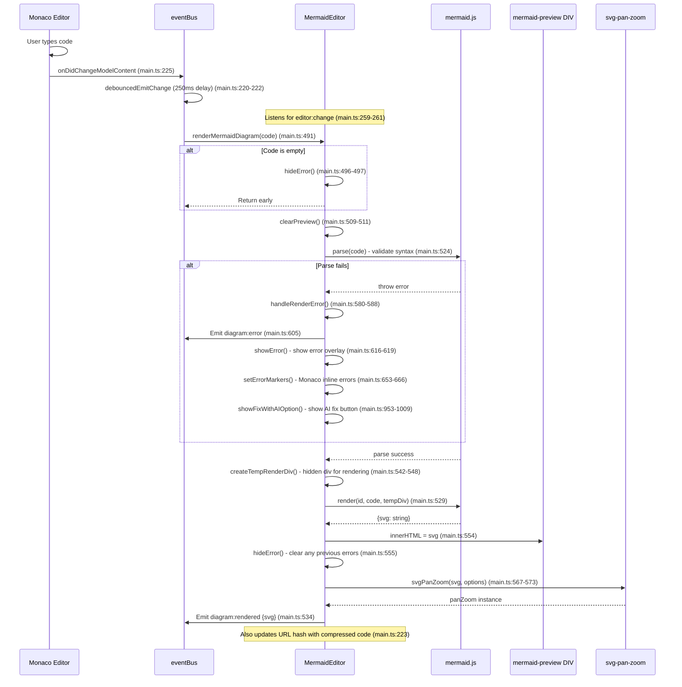
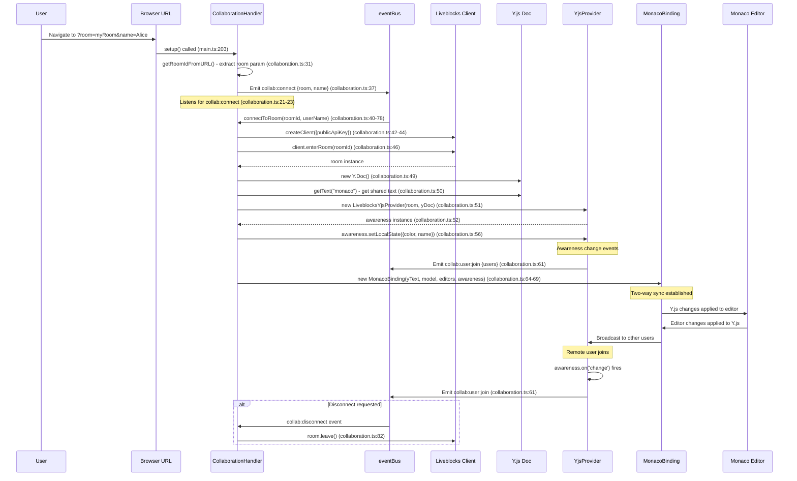
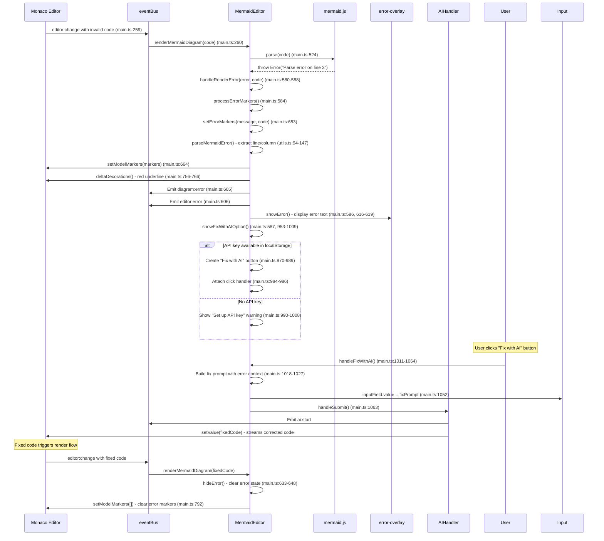
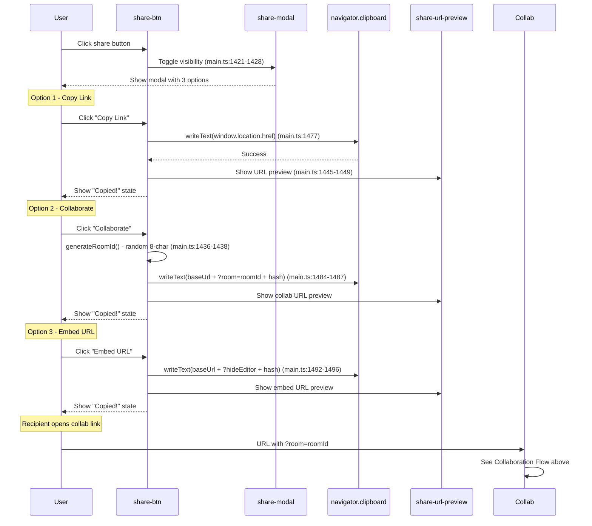

# Key Flows

This document describes the critical execution paths in the MinimalMermaid application.

## Application Initialization Flow

**Trigger**: Browser loads index.html, which imports main.ts at line 255

**Outcome**: Fully initialized MermaidEditor with Monaco Editor loaded, event handlers wired, handlers set up, and initial diagram rendered from URL hash if present.

## AI Diagram Generation Flow

**Trigger**: User enters prompt and presses Enter, or clicks a preset

**Outcome**: AI generates Mermaid code, streams it into the editor, and the diagram preview updates automatically.

## Diagram Preview Rendering Flow

**Trigger**: Editor content changes (debounced by 250ms)

**Outcome**: Mermaid diagram is rendered to SVG and displayed in preview pane with pan/zoom enabled.

## Real-Time Collaboration Flow

**Trigger**: User accesses URL with ?room=roomId parameter

**Outcome**: User connects to Liveblocks room, Y.js CRDT syncs editor content, cursor awareness shows other users.

## Error Handling with AI Fix Flow

**Trigger**: Mermaid parse fails during diagram rendering

**Outcome**: Error displayed in overlay and Monaco editor, AI fix button shown if API key available.

## Share/Collaboration Link Generation Flow

**Trigger**: User clicks Share button and selects link type

**Outcome**: Appropriate URL copied to clipboard with room ID, embed mode, or diagram hash.

